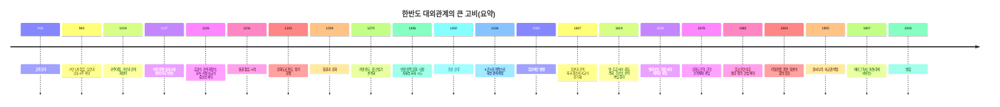

# 한반도 역사에서 강대국 외교를 ‘가장 잘’한 주체는 누구인가

## Executive summary

이익주가 지구본 도서관의 한 영상 주제로 던진 질문은 한 줄로 요약하면 이것이다. “강대국 사이에 끼인 나라는 대체 어떻게 살아남았나”라는 질문이다. 답을 뽑으려면 “멋있게 큰소리친 나라”가 아니라 “작게라도 실질을 챙기며 오래 버틴 나라”를 봐야 한다. 외교는 자존심 경연이 아니라 생존 관리이기 때문이다.  

본 글은 그 기준을 “생존(국가·왕조의 지속) + 주권의 실질(내정 자율성) + 영토 보전 + 경제·문화의 자율성”으로 잡는다. 이 기준으로 시기를 훑어보면 결론은 비교적 선명해진다. 한반도 역사에서 강대국 상대 외교를 가장 ‘잘’했다고 평가할 여지가 큰 주체는 고려, 그중에서도 전기~대몽항쟁 전후를 관통한 “유연한 다중 외교”의 축적이다.  

조선은 초기에 “규범화된 외교 운영(사대교린)”을 정교하게 구축했고, 전쟁 이후에는 관계 복구(일본과의 장기 외교)를 장기 프로젝트로 밀어붙이는 능력도 보였다. 다만 17세기 전환기에는 ‘이념의 핸들’이 ‘현실의 브레이크’를 고장 내는 순간들이 있었고, 19세기 말~20세기 초 대한제국기 외교는 룰 자체가 갈아엎어진 게임(제국주의·근대 조약체제)에서 체급과 내부 역량이 크게 밀리며 구조적으로 막혔다. 한마디로, 고려는 “여러 상사(강대국)를 동시에 상대해도 회사가 굴러가게 만든 팀장”에 가깝고, 조선 말은 “회사 규정집이 바뀐 줄 모르고 예전 결재선만 타다가 프로젝트를 통째로 뺏긴 팀”에 가깝다.  

## 고려에서 대한제국까지

### 고려의 ‘다중 외교’는 왜 히트했는가

외교를 잘한다는 건 사실상 “상대가 원하는 것”과 “내가 끝까지 지켜야 할 것”을 분리해 손에 쥐고 흔드는 기술이다. 고려가 빛나는 지점이 바로 여기이다. 고려가 마주한 동아시아는 단순히 “중국 한 나라”가 아니라, 송—요—금으로 이어지는 북방 정복왕조와 중원 왕조가 공존·경합하는 다극적 판이었다. 즉, “하나의 큰형”만 있는 골목이 아니라, 덩치 큰 형들이 여러 명인 골목이었다. 이런 골목에서 살아남는 법은 한 가지이다. 한 형에게 굴욕을 느끼기 전에, 다른 형과의 관계도 동시에 관리하면서 ‘내가 완전히 한쪽 편이 아니다’라는 신호를 조절하는 것이다. 고려는 이걸 ‘감정’이 아니라 ‘기술’로 만들었다.  

가장 유명한 장면이 993년이다. 서희가 거란군 진영에서 담판해 “강동 6주”를 확보했다는 서사는 너무 유명해서 오히려 오해도 낳는다. 이 사건의 포인트는 ‘말빨’이 아니라 ‘상대의 목적 읽기’이다. 거란(요)이 문제 삼은 핵심은 고려가 송과 통하는 길(정치적 연계)을 열어둘 가능성이었다. 서희는 그 지점을 찌르되, 고려가 당장 할 수 없는 약속(상대가 원하는 단기 ‘안보’ 신호)은 던지고, 고려가 반드시 지켜야 할 선(영토의 실익)은 가져오는 방식으로 협상을 설계했다. 쉽게 비유하면 이렇다. 월세 협상에서 집주인이 “다른 세입자랑 너무 친해지지 마”라고 말할 때, 세입자는 “알겠어요. 대신 보일러 고쳐주세요”라고 거래를 한다. ‘친해지지 말기’는 모호하지만, 보일러는 실물이다. 고려가 챙긴 건 보일러 같은 실물(영토·완충지·시간)이었다.  

그 뒤의 행보는 더 중요하다. 고려는 1~3차 거란 침입을 거치면서 “싸울 때는 싸우고, 싸운 뒤에는 빨리 전쟁을 끝내는 외교”를 반복 학습한다. 강감찬의 귀주대첩 같은 전투 성과가 ‘외교의 제로섬 승리’로 이어지지 않도록, 전쟁 종결을 위한 명분과 절차를 빠르게 회복하는 쪽으로 기울어 간다. 여기서 핵심은 “형식(책봉·연호·사대)”과 “실질(내정·군사·영토)”을 분리해 운영하는 능력이다. 형식을 주면 실질을 덜 내놓아도 되는 경우가 생긴다. 오늘날 회사에서도 비슷하다. 상사가 원하는 보고서 표지(형식)를 맞춰주면, 내용(실질)을 내 뜻대로 설계할 여지가 생긴다. 고려는 이 ‘표지 관리’를 국가 단위로 해낸 셈이다.  

12세기에 들어서면 고려의 외교는 한층 ‘조직화’된다. 요가 금으로 교체되는 순간(강대국 교체 국면)은 약소국에게 가장 위험한 시기인데, 고려는 새 강자의 요구를 무작정 거부하기보다, 관계를 재설정하면서도 마찰 비용을 줄이는 쪽을 택한다. 특히 금과의 관계에서는 외교 문서·사절 운영 같은 실무가 중요해지는데, 이건 “이젠 말싸움이 아니라 계약서 싸움이다”라는 신호이다. 그래서 고려는 외교 실무를 전담하는 기구를 두고, 요구되는 문서(서표 등)를 둘러싼 ‘문구 전쟁’을 벌이며 시간을 끌고 조건을 조정한다. 사람으로 치면, 동네 분쟁이 생기면 ‘말솜씨 좋은 친구’만 데려가는 게 아니라 ‘등기부등본 잘 보는 친구’도 데려가는 단계로 넘어간 것이다. 이런 관료적·문서 중심 외교는, 강대국이 “너 우리 편 맞지?”를 물을 때 “맞다/아니다”로 즉답하지 않고 “그 표현은 이렇고 저 표현은 저렇다”로 완급을 조절하게 해준다.  

13세기 몽골제국(원)과의 충돌은 고려 외교의 ‘최종 보스전’이다. 여기서 고려가 보여준 건 두 가지이다. 첫째, 완전히 압도적인 상대를 만나면 정면승부 대신 지형·시간·사회 동원을 결합해 버티는 전략을 쓴다. 수도를 강화도로 옮기는 선택은 단순한 도피가 아니라 “상대가 가진 장점(기병 중심의 기동력)을 최대한 무력화하는 판 짜기”에 가깝다. 둘째, 버틴 뒤의 협상은 ‘완승’이 아니라 ‘살아서 다음 판을 여는 조건’이어야 한다. 고려는 장기 항쟁 끝에 강화를 맺었고, 이후 원 간섭기에는 왕실 혼인 같은 매우 불편한 수단까지 동원해 왕조 자체를 유지한다. 이게 아름답다고 말하긴 어렵다. 하지만 외교를 생존기술로 보면, 그 불편함이 바로 성과이기도 하다. “국가 자체가 사라지는 엔딩”을 피했기 때문이다.  

그리고 고려의 진짜 무서운 점은, 강대국이 약해질 때를 놓치지 않는다는 데 있다. 원의 힘이 흔들리면, 공민왕 대에 들어 내정 간섭 기구를 없애고 영토·사법권을 회복하는 식의 반원 정책으로 ‘다시 판을 정상화’하려 한다. 즉, 고려는 굴복과 저항을 ‘감정’으로 하지 않고, 국제 환경의 기울기에 맞춰 ‘타이밍 게임’으로 한다. 오늘날 시장에서 대기업이 흔들릴 때 중견기업이 계약 조건을 재협상하는 것과 비슷한 장면이다.  

요약하면, 고려의 강대국 외교가 강한 이유는 “한쪽에 올인하지 않는 분산 운영”, “형식과 실질의 분리”, “싸움-협상-질서 회복의 루프”, “조직화된 문서·사절 운영”, “환경 변화에 따른 빠른 리셋”이 동시에 존재했기 때문이다. 줄타기로 비유를 많이 하지만, 고려는 사실 줄만 탄 게 아니라 안전망(다중 채널)과 균형추(형식/실질 분리)까지 갖춘 연기자에 가깝다.  

### 조선과 근대의 ‘단일 채널’이 흔들릴 때

조선의 외교는 한 문장으로 정의되곤 한다. 사대교린이다. 큰 나라(중국)에는 예를 다하고, 주변 이웃(일본·여진 등)과는 교류와 견제를 병행한다는 원칙이다. 이 원칙 자체는 꽤 똑똑하다. 문제는 원칙이 “고정값”이 되면, 세상이 바뀔 때 업데이트가 늦어진다는 점이다.  

조선 전기에는 이 시스템이 잘 돌아간다. 명이라는 안정적 상수가 존재했고, 조선은 그 상수와의 관계에서 정통성·안보·교역 창구를 확보한다. 동시에 북방에서는 여진 세력의 변동을 틈타 군사·이주·행정 조치를 결합한 영토 경영(4군6진)을 추진해 경계를 확정해 간다. 이건 외교와 군사가 분리된 게 아니라, “외교 목표(안정) = 국경 운영(현장)”이라는 현실적 결합이다. 회사로 치면, 본사(명)와 관계를 잘 관리하면서도, 현장 지점(북방)은 직접 시스템을 깔아 운영한 셈이다.  

일본과의 관계도 흥미롭다. 조선은 기본적으로 왜구를 막고 해상 질서를 관리하는 데 방점을 찍었고, 중개자(대마도)를 활용해 ‘완전한 단절’과 ‘무제한 개방’ 사이의 회색지대를 만든다. 이 회색지대는 귀찮고 늘 분쟁이 생기지만, 오히려 그 귀찮음이 완충 역할을 한다. 외교에서 완충은 꽤 비싼 자산이다.  

그런데 16세기 말은 조선 외교가 “상수(명)가 영원할 것”이라는 가정에 크게 의존했음을 드러낸 시기이기도 하다. 임진왜란은 ‘교린’의 실패(일본의 의도 오판)와 ‘사대’의 의존(명 원군 요청)이 동시에 폭발한 사건이다. 전쟁 자체는 외교 실패의 결과이지만, 전쟁 뒤의 외교는 또 다른 실력을 보여준다. 조선은 일본과의 관계를 다시 일상으로 돌려놓기 위해, 대규모 문화·외교 사절단(통신사)이라는 장기 프로젝트를 가동한다. 여기에는 단순한 친선이 아니라 정보 수집, 의례 조정, 무역 질서 관리가 뒤엉켜 있다. “싸운 뒤에도 연락은 끊지 않는다”는 원칙을 200년 가까이 제도화한 것이다. 이 대목은 조선 외교의 꽤 높은 점수 구간이다.  

조선이 크게 미끄러지는 지점은 17세기 ‘강대국 교체 국면’이다. 명과 후금(뒤에 청) 사이에서 조선이 취할 수 있는 옵션은 냉정히 세 가지뿐이다. (1) 명에 올인한다, (2) 새 강자를 인정한다, (3) 겉으로는 명, 속으로는 중립·완충을 한다. 조선에도 (3)을 시도한 왕이 있다. 광해군이다. 문제는 외교의 성패가 외부만으로 결정되지 않는다는 데 있다. 내부 정치가 외교 핸들을 빼앗아 갈 때가 있다. 광해군의 중립 노선은 내부에서 “의리 문제”로 공격받고, 정권 교체(인조반정) 뒤에는 외교 노선이 급격히 바뀐다. 그리고 후금—청은 “우리 적이 될 가능성을 먼저 제거”하는 방식으로 조선을 압박한다. 정묘호란과 병자호란은 그런 연쇄의 결과이다.  

인조의 시기, 특히 병자호란은 조선 외교를 생각할 때 늘 등장하는 장면(남한산성, 삼전도의 굴욕)으로 남아 있다. 다만 여기서 중요한 건 “굴욕 vs 자존심”의 감정평가가 아니라, “전쟁을 막을 외교적 완충이 왜 작동하지 않았나”의 분석이다. 조선은 명-청 교체라는 구조적 변화 앞에서, ‘형식의 전환’(새 황제국 인정)을 내부적으로 소화하지 못했고, 주화론·척화론 논쟁에서도 결국 새 질서를 받아들일 준비가 부족했다. 그 결과 전쟁이 났고, 전쟁 뒤에는 현실적으로 ‘대청 사대’라는 새 시스템에 편입된다.  

아이러니는 그 다음이다. 조선은 청에 굴복했지만 곧 망하지는 않는다. 오히려 이후 장기 평화 속에서 내정의 자율성을 상당히 유지하며, 문화적으로는 ‘소중화’ 같은 자기 정체성 장치를 만들어 심리적 균형을 잡는다. 즉, 조선의 17세기 외교는 “선제적 전환 실패로 전쟁 비용을 크게 치렀지만, 전후에는 제한된 공간 안에서 제도를 재정비해 생존에는 성공한 케이스”라고 보는 편이 더 정확하다.  

그런데 19세기 후반으로 가면, 게임의 룰이 바뀐다. 조공·책봉 질서는 체면과 절차를 중심으로 굴러가는 ‘의례 기반 질서’였고, 그 안에서는 약소국이 형식을 내주고 실질을 지키는 거래가 가능했다. 반면 근대 제국주의는 “형식”이 아니라 “권리 그 자체(치외법권, 관세권, 군사 통행, 고문 정치)”를 계약서로 박아 가져간다. 예전에는 표지를 맞춰주면 내용 방어가 되던 세계였다면, 이제는 내용의 소유권을 빼앗기는 세계이다.  

1876년 강화도조약은 그 문이 열리는 순간이다. 조약은 “조선은 자주국”이라는 문구를 앞에 내세우면서도, 실제로는 해안 측량·치외법권 같은 조항으로 주권을 갉아먹는 구조를 깔아 둔다. 1882년 조미수호통상조약 같은 형태로 서구식 조약이 확대되지만, 여기서도 ‘거중조정’ 같은 장치는 기대만큼 작동하지 않는다. 조선은 조약이라는 신문물을 받아들이며 “국제 규범이 나를 지켜줄 수 있다”는 희망을 품지만, 그 규범은 결국 힘의 배치 위에서만 움직인다.  

1882년 임오군란 이후에는 더 복잡해진다. 청은 전통적 조공관계를 근대 국제법 언어로 ‘속방’처럼 재포장하려는 시도를 하고, 조선 내부에서는 개화파·수구파가 외교 노선을 두고 충돌한다. 외교가 어려운 이유가 여기에 다 들어 있다. 강대국이 두 셋이 아니라, 강대국과 국내 정치가 동시에 협상 테이블에 앉아 있는 상황이다. 이때 외교는 “국가의 입장”이 아니라 “국가 안의 여러 팀이 서로 다른 입장으로 동시에 말하는 상태”가 되기 쉽다. 회사에서 영업팀은 A기업 편, 재무팀은 B은행 편, 홍보팀은 C언론 편으로 움직이면 협상은 거의 무조건 망가진다.  

그리고 결정타는 1904년 러일전쟁 국면이다. 일본은 군사력으로 한반도를 장악한 상태에서 여러 협약을 강요하며 보호국화의 단계적 절차를 밟고, 1905년에는 을사늑약으로 외교권을 박탈한다. 고종은 국제 여론전을 시도한다. 헤이그에 특사를 보내는 사건은 그 상징이다. 이준 등이 국제사회에 호소했지만, 열강의 이해관계는 이미 기울어 있었다. 이 시기의 외교는 “노력했으나 실패했다”가 아니라 “노력의 효과가 나올 구조가 거의 사라져 있었다” 쪽에 가깝다. 냉정하게 말하면, 조선/대한제국은 외교를 못 해서만 무너진 게 아니라, 외교가 작동하려면 최소한의 군사·재정·행정 역량(그리고 내부 합의)이 있어야 하는데, 그 바닥이 너무 약해진 상태에서 세계가 가장 거칠게 확장하던 제국주의 파도와 정면으로 부딪힌 것이다.  

## 결론

“강대국 상대 외교를 가장 잘한 나라/시기는 무엇인가”라는 질문에 하나만 고르라면, 답은 고려이다. 다만 그 이유는 “고려가 항상 옳았다”가 아니라, “고려가 ‘약소국 생존 외교’의 도구 상자를 가장 넓게 갖고 있었고, 그것을 여러 차례의 강대국 교체 국면에서 실제로 굴려 봤기 때문”이다.  

고려의 성과는 (1) 다극 체제에서 한쪽에 고정되지 않고 채널을 분산한 점, (2) 형식(사대·책봉·연호·조공)과 실질(내정·영토·군사)의 거래를 구분해 운영한 점, (3) 전쟁을 ‘끝내는 외교’까지 포함해 설계한 점, (4) 문서·사절·제도 같은 조직 역량을 축적한 점, (5) 원이 약해질 때 주권 회복을 시도하는 ‘리셋 감각’을 가졌다는 점에서 나온다.  

조선은 전기에는 굉장히 잘했다. 사대교린은 안정적 국제질서에서 비용 대비 효율이 높은 운영체제였고, 4군6진 같은 국경 경영은 외교 목표를 ‘현장 시스템’으로 구현한 사례이다. 임진왜란 이후 통신사 외교를 장기 운영한 집요함도 인정할 만하다. 그러나 17세기 전환기에는 이념이 현실을 압도하는 순간들이 있었고, 그 비용으로 전쟁을 치렀다.  

근대 조선/대한제국의 실패는 평가가 더 조심스럽다. 거문도 중립론, 거중조정 기대, 헤이그 특사 같은 선택은 “룰이 바뀌었음을 이해하고 새 도구(국제법·여론전)를 잡아보려 했던 시도”이기도 하다. 하지만 그 시도는 당시 강대국의 ‘합의된 무시’와 내부 역량 부족 앞에서 번번이 막혔다. 외교가 실패한 게 아니라, 외교가 먹힐 공간이 거의 사라진 상태에서 마지막까지 비상구를 찾다가 문이 잠긴 것을 확인한 장면에 가깝다.  

그래서 결론은 이렇게 정리된다. 고려는 “강대국 사이에서 살아남는 법”을 가장 현실적으로 체화한 주체이고, 조선은 “안정된 질서에서는 매우 잘했지만 질서가 뒤집힐 때 업데이트가 늦어 비용을 치른 주체”이며, 대한제국기는 “경기 규칙이 바뀐 뒤, 선수 교체와 훈련까지 동시에 해야 했는데 시간도 체력도 부족했던 주체”이다. 외교를 ‘멋’이 아니라 ‘생존 기술’로 본다면, 고려가 한반도 역사에서 가장 높은 점수를 받을 만하다는 결론이 남는다.  

## Reference list

| 출처명 | 유형(논문/책/웹/1차) | URL | 간단 메모(핵심 근거) |
|---|---|---|---|
| 고려사: 「서희」 열전(국역 포함) | 1차 | `https://db.history.go.kr/goryeo/itemLevelKrList.do?parentId=kr_094r_0010_0010&types=r` | 서희의 담판 이후 조정의 후속 대응(사신 파견, 조근·빙례 등) 맥락 확인.  |
| 고려사 비교보기: “서희가 … 강동6주 지역을 확보하다” | 1차 | `https://db.history.go.kr/goryeo/compareViewer.do?levelId=kr_094_0010_0010_0040` | 강동6주 확보 서사의 원문/국역 비교 기반(사료로서의 문장 구조 확인).  |
| 사료로 본 한국사: “서희의 외교 담판” | 1차/웹 | `https://contents.history.go.kr/mobile/mid/hm_048_0020?tabId=e` | 의례(절) 문제를 협상력의 일부로 삼는 장면 등 협상 방식의 디테일 제공.  |
| 우리역사넷 교과서 용어: “강동 6주” | 웹 | `https://contents.history.go.kr/front/tg/view.do?levelId=tg_002_1060` | 993년 협상 논리(고구려 계승·여진·연호/조회 조건)와 영토 확보의 의미 정리.  |
| 한국민족문화대백과: “강동육주” | 웹 | `https://encykorea.aks.ac.kr/Article/E0001049` | 강동6주의 구성·침입 전후 전개와 방어 거점 의미 요약.  |
| 우리역사넷: “거란의 고려침입” | 웹 | `https://contents.history.go.kr/mobile/kc/view.do?code=kc_age_20&levelId=kc_i200300` | 거란의 침입 전후, 귀주대첩 이후 관계 회복 시도 등 큰 흐름 정리.  |
| 우리역사넷: “국교 수립과 단절”(고려-거란/송 관계 포함) | 웹 | `https://contents.history.go.kr/front/km/print.do?levelId=km_030_0040_0010_0010` | 전쟁기에도 사행·연호 사용 등 ‘형식/실질’ 분리 운영 사례를 설명.  |
| 서울대 학위/논문(PDF): “송 사신단의 개경 유관과 외교 공간 활용” | 논문 | `https://s-space.snu.ac.kr/bitstream/10371/168194/1/88_1-%EC%9D%B4%EC%8A%B9%EB%AF%BC.pdf` | 12세기 고려가 거란과 안정 관계를 유지하면서 송과 사행을 재개하는 ‘다중 운용’ 맥락.  |
| KCI: “고려시대 금과의 대외관계와 同文院” | 논문 | `https://www.kci.go.kr/kciportal/ci/sereArticleSearch/ciSereArtiView.kci?sereArticleSearchBean.artiId=ART002038719` | 금과의 사대 노선 확정 이후 문서(서표) 압박, 외교 실무 조직화의 사례.  |
| 우리역사넷: “여진족이 건국한 금의 팽창”(동북9성 반환 논의 포함) | 웹 | `https://contents.history.go.kr/mobile/kc/view.do?code=kc_age_20&levelId=kc_i201130` | 동북9성 설치·유지의 어려움과 반환까지의 ‘손절 타이밍’ 맥락.  |
| 우리역사넷 인물: “윤관” | 웹 | `https://contents.history.go.kr/mobile/kc/view.do?code=kc_age_20&levelId=kc_n203400` | 동북9성 관련 전개와 정책적 맥락(이주·포상 등) 요약.  |
| 우리역사넷: “몽골의 고려침입” | 웹 | `https://contents.history.go.kr/mobile/kc/view.do?code=kc_age_20&levelId=kc_i200800` | 1231~1259 장기 침입, 강화·1270 환도·삼별초로 이어지는 큰 프레임 제공.  |
| 한국민족문화대백과: “강화천도” | 웹 | `https://encykorea.aks.ac.kr/Article/E0001532` | 강화천도의 배경(정권 보위·공물·인질 요구 회피/지연 등)과 결과를 요약.  |
| 한국민족문화대백과: “반원정치” | 웹 | `https://encykorea.aks.ac.kr/Article/E0070276` | 1356년 공민왕 반원 정책(이문소 혁파·쌍성총관부 수복 등) 개요.  |
| 사료로 본 한국사: “공민왕의 개혁정책과 신돈” | 웹/1차 | `https://contents.history.go.kr/id/hm_053_0010` | 반원 정책·개혁의 구체 항목(연호·관제·사법권 등) 설명.  |
| 우리역사넷 교과서 용어: “사대교린” | 웹 | `https://contents.history.go.kr/front/tg/view.do?levelId=tg_003_1130` | 사대(책봉국-황제국)·교린(중국 외 관계) 개념 구분과 전근대 외교 질서 설명.  |
| 한국민족문화대백과: “사대교린” | 웹 | `https://encykorea.aks.ac.kr/Article/E0025448` | 조선의 외교 운영 원리(사대/교린)와 명·청 교체기 변동 개관.  |
| 우리역사넷(PDF): “조선 초기의 대외관계” | 웹/기초자료 | `https://contents.history.go.kr/data/pdf/nh/nh_022_0030.pdf` | 사대교린의 형성·제도화 맥락(경국대전 등)과 15세기 국제환경 설명.  |
| 우리역사넷: “4군 6진 개척” | 웹 | `https://contents.history.go.kr/mobile/kc/view.do?code=kc_age_30&levelId=kc_i300200` | 세종대 북방 개척의 배경(여진 침입)과 군사·행정 결합의 경계 확정 과정.  |
| 한국민족문화대백과: “육진” / “사군” | 웹 | `https://encykorea.aks.ac.kr/Article/E0042168` | 두만강/압록강 방면 군사행정구역 설치와 북방 경계 확정의 의미.  |
| 우리역사넷: “광해군의 중립 외교” | 웹 | `https://contents.history.go.kr/mobile/mid/ta_m71_0060_0030_0020_0020` | 명-후금 사이 중립 외교의 의도와 내부 정치적 반발(정권 교체의 명분화) 정리.  |
| 동북아역사넷: “정묘·병자 전쟁과 새로운 질서의 형성” | 웹 | `https://contents.nahf.or.kr/id/NAHF.edeao.d_0004_0010_0020` | 1619 사르후 전투 이후 명의 추가 파병 요구와 광해군의 대응, 전환기 압력 구조 설명.  |
| 우리역사넷: “병자호란” | 웹 | `https://contents.history.go.kr/mobile/kc/view.do?code=kc_age_30&levelId=kc_i302800` | 정묘호란-병자호란 연쇄, ‘대청 사대’ 편입과 ‘대명 의리’의 공존이라는 구조 요약.  |
| 역주조선왕조실록(용어): “병자호란” | 웹 | `https://waks.aks.ac.kr/rsh/dir/rview.aspx?dataID=AKS-2013-CKD-1240001_DIC%4000012811&rshID=AKS-2013-CKD-1240001` | 병자호란의 정의·기간(50일) 등 기본 사실 확인.  |
| 한국민족문화대백과: “통신사” | 웹 | `https://encykorea.aks.ac.kr/Article/E0059354` | 통신사가 수행한 목적(우호·정보·의례·교섭)과 시기별 과제 예시 제시.  |
| 동북아역사넷: 조선통신사 개요(1607~1811, 12회) | 웹 | `https://contents.nahf.or.kr/item/item.do?levelId=edkj.d_0001_0020_0030` | 통신사의 장기 운영(횟수·기간) 등 큰 틀 제공.  |
| 우리역사넷: “문화 외교 사절단의 유산, 통신사 기록물” | 웹 | `https://contents.history.go.kr/mobile/eh/view.do?code=eh_age_30&levelId=eh_r0251_0010` | 통신사 규모(수백 명), 이동 기간, 구성(역관·제술관·화원 등) 등 설명.  |
| 우리역사넷: “강화도 조약(1876)” | 웹 | `https://contents.history.go.kr/mobile/kc/view.do?code=kc_age_40&levelId=kc_i400800` | 12개조 핵심(개항, 해안측량 허용, 속인주의 등)과 불평등 요소 정리.  |
| 사료로 본 한국사: “강화도 조약-조일 수호 조규”(원문 일부) | 1차/웹 | `https://contents.history.go.kr/front/hm/view.do?levelId=hm_115_0010` | 제1관 ‘자주’ 문구 등 조약 문장 자체 확인(형식과 실질의 괴리 읽기).  |
| 한국민족문화대백과: “강화도조약” | 웹 | `https://encykorea.aks.ac.kr/Article/E0001508` | 운요호 사건과 조약 체결 배경, 영사재판권·측량권 등 핵심 독소 조항 요약.  |
| 동북아역사재단 웹진: 강화도조약 ‘포함외교’ 맥락 | 웹 | `https://www.nahf.or.kr/web/portal/webzine/774/27188` | 포함외교와 ‘평등 문구+불평등 내용’의 구조 설명.  |
| 사료로 본 한국사: “조미 수호 통상 조약” | 웹 | `https://contents.history.go.kr/id/hm_115_0060` | 거중조정 조항의 한계, 치외법권 등 불평등 요소 설명.  |
| 우리역사넷: “임오군란(1882)” | 웹 | `https://contents.history.go.kr/mobile/kc/view.do?code=kc_age_40&levelId=kc_i403200` | 군란 이후 청의 내정·외교 간섭(군대 주둔, 고문 파견, 종주권 명시) 요약.  |
| 우리역사넷: “한일의정서(1904)” | 웹 | `https://contents.history.go.kr/mobile/kc/view.do?code=kc_age_40&levelId=kc_i403500` | 전시중립 논의와 일본의 비밀 협약 강요 맥락 제공.  |
| 우리역사넷 교과서 용어: “제1차 한일 협약” | 웹 | `https://contents.history.go.kr/front/tg/view.do?levelId=tg_004_0910` | 고문 정치로 재정·외교권 침해가 심화되는 단계 설명.  |
| 우리역사넷 사료: “을사늑약(을사조약)” | 웹 | `https://contents.history.go.kr/mobile/hm/view.do?levelId=hm_121_0030` | 외교권 박탈과 통감부 설치 등 을사늑약의 핵심 결과 정리.  |
| 한국민족문화대백과: “을사늑약” | 웹 | `https://encykorea.aks.ac.kr/Article/E0042958` | 1905년 외교권 박탈 조약의 정의·배경·내용 개관.  |
| 한국민족문화대백과: “헤이그 특사 사건” | 웹 | `https://encykorea.aks.ac.kr/Article/E0063241` | 1907년 만국평화회의 특사 파견의 경과·결과(회의 참가 거부 등) 요약.  |
| 우리역사넷: “헤이그특사 사건” | 웹 | `https://contents.history.go.kr/mobile/kc/view.do?code=kc_age_40&levelId=kc_i403600` | 고종의 무효 주장, 미국 등 열강의 비협조 등 외교 실패의 구조적 요인 제시.  |
| 동북아역사넷: “러일전쟁과 한국 강제병합” | 웹 | `https://contents.nahf.or.kr/item/item.do?levelId=edeah.d_0005_0020_0020_0030` | 1904~1905 단계적 보호국화(의정서→협약→을사늑약)와 열강 승인 맥락 제공.  |
| KCI/DBpia: “10~12세기 조공·책봉체제의 실태와 변용” | 논문 | `https://www.kci.go.kr/kciportal/ci/sereArticleSearch/ciSereArtiView.kci?sereArticleSearchBean.artiId=ART002719422` | 10~12세기 동아시아가 ‘일원적’ 질서가 아니라 다원적 세력균형으로 변형된다는 논지.  |
| KCI: “조공체제 개념에 대한 비판적 고찰” | 논문 | `https://www.kci.go.kr/kciportal/landing/article.kci?arti_id=ART002132937` | 조공체제가 현실을 과잉 단순화할 수 있다는 비판과 ‘관념-현실 괴리’ 논점 제공.  |
| 한국민족문화대백과: “조공” | 웹 | `https://encykorea.aks.ac.kr/Article/E0051587` | 조공이 상하관계의 형식을 띠면서도 ‘양자 이익’이 걸린 합목적적 행위였다는 관점 정리.  |
| 동북아역사넷: “조공·책봉 관계의 형성” | 웹 | `https://contents.nahf.or.kr/item/item.do?levelId=edeao.d_0002_0040_0010` | 유목 정권의 경제적 욕구와 중원 왕조의 현실 외교가 맞물려 조공·책봉 형식이 성립했다는 설명.  |
| 우리역사넷: “조선책략과 만국공법” | 웹 | `https://contents.history.go.kr/mobile/ts/view.do?levelId=ts_b16` | 만국공법·포함외교·불평등 조약의 연결, 조선 지식계의 규범 기대를 설명.  |
| 서울대 논문(PDF): “개화기 서구 국제법의 수용과 근대국제질서 인식” | 논문 | `https://s-space.snu.ac.kr/bitstream/10371/90070/1/4%20%EA%B0%9C%ED%99%94%EA%B8%B0%20%EC%84%9C%EA%B5%AC%20%EA%B5%AD%EC%A0%9C%EB%B2%95%EC%9D%98%20%EC%88%98%EC%9A%A9%EA%B3%BC%20%EA%B7%BC%EB%8C%80%EA%B5%AD%EC%A0%9C%EC%A7%88%EC%84%9C%EC%9D%98%20%EC%9D%B8%EC%8B%9D-%EA%B9%80%ED%98%84%EC%B2%A0%20%28%20Hyun%20Chul%20Kim%20%29%20.pdf` | 1876년 전후 ‘만국공법’이 언급·전래되는 구체 사례를 통해 근대 규범의 유입 과정을 보여줌.  |
| 우리역사넷: “불평등조약체제의 수립과 그 영향” | 웹 | `https://contents.history.go.kr/mobile/nh/view.do?levelId=nh_037_0050_0050_0020` | 강화도조약-최혜국조항 등으로 ‘연결된 불평등 조약체제’가 형성되고 침탈이 촉진되는 구조 설명.  |
