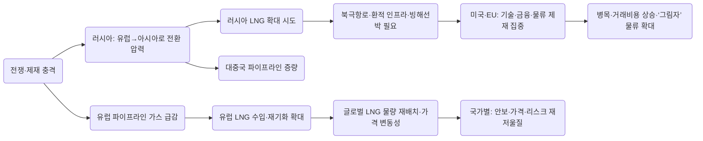

# 북극항로와 러시아 LNG: 제재 시대에 에너지 안보는 어떻게 다시 짜이고 있는가

## Executive summary

우크라이나 전쟁 이후 에너지 질서는 “누가 더 싼 가스를 파느냐”의 문제가 아니라 “누가 어떤 경로·선박·보험·금융을 붙잡고 있느냐”의 문제로 바뀌었다. 유럽은 러시아 파이프라인 가스의 급감으로 LNG(액화천연가스)로 급전환했고, 그 과정에서 글로벌 LNG 물량이 아시아·라틴아메리카에서 유럽으로 재배치되며 가격·계약·물류가 동시에 흔들렸다. 국제에너지기구(IEA)는 2022년에 유럽 LNG 수입이 전년 대비 64bcm(60%+) 급증해 러시아 파이프라인 감소를 사실상 대체했다고 정리한다. 

러시아는 “유럽→아시아”로 방향을 틀었지만, 가스는 석유처럼 배로 쉽게 바꿔 싣기 어렵다. 파이프라인은 노선이 고정이고, LNG는 기술·선박·항만·보험이 한 몸이다. 그래서 미국·EU 제재는 생산(유정) 자체보다 LNG 밸류체인의 ‘목’—액화기술·극지용 운반선·환적(트랜스십먼트)·보험·결제—로 초점이 이동했다. 옥스퍼드에너지연구소(OIES)는 러시아 신규 LNG 프로젝트가 “복잡한 가치사슬과 고유 기술 의존” 때문에 제재에 취약하며, 특히 ‘물류(운반)’를 겨냥한 제재가 신규 프로젝트 가동률과 거래비용을 크게 악화시킨다고 평가한다. 

북극항로(러시아 연안의 Northern Sea Route, 이하 NSR)는 이 재편의 교차점이다. 지도상으로는 ‘지름길’이지만, 현실에선 ‘계절제 고속도로’에 가깝다. 여름–가을엔 시간이 절약되지만, 겨울엔 쇄빙선 동반·감속·대기·보험료·선박(빙해등급) 비용이 붙는다. 러시아는 NSR을 자국 자원(특히 Arctic LNG·원유) 수출 회랑으로 키웠고, 2024년 NSR 전체 화물 물동량은 약 3,790만 톤으로 사상 최고치를 기록했다. 다만 국제 환적·통과(Transit) 물동량은 훨씬 작고, 2024년 기준 ‘통과 항해’가 기록을 세워도 300만 톤 규모에 머문다. 

“동맹보다 국익”은 이 국면에서 슬로건이 아니라 실제 의사결정 규칙처럼 작동한다. 유럽은 러시아산 LNG를 완전 차단하지 못한 채 단계적 금지로 가고, 일본은 사할린 LNG를 “에너지 안보”로 방어하며, 중국은 러시아의 ‘급한 사정’을 가격 협상력으로 전환한다. 한국은 러시아산 비중을 낮추면서도 스팟시장 변동성을 피하려 장기계약과 공급원 다변화를 강화한다. 이 차이는 (1) 전력·산업구조, (2) 대체 가능한 인프라(FSRU·파이프라인·저장)와 계약구조, (3) 2차 제재(Secondary sanctions) 리스크에 대한 금융 시스템의 민감도, (4) 국내 정치가 허용하는 가격 상승 여지에서 나온다. 

## 전쟁과 제재가 만든 재배치의 시간축

전쟁 이전 유럽의 러시아 의존은 “값싼 파이프라인 가스+장기계약”이라는 안정 장치였다. 그런데 IEA는 2021년 말부터 러시아 파이프라인 흐름이 감소했고, 2022년에 OECD 유럽向 러시아 파이프라인 수출이 전년 대비 약 50%(83bcm) 감소했다고 짚는다.  이 ‘구멍’은 즉시 LNG 시장을 통해 전 세계로 전염됐다. 유럽이 LNG를 흡수하자 아시아의 LNG 수입이 줄고, 수요 파괴(특히 가격 민감한 시장)까지 동반되었다는 것이 IEA의 핵심 진단이다. 

유럽의 대응은 세 갈래였다. 첫째, LNG 재기화(기체화) 인프라를 ‘속전속결’로 늘렸다. IEA는 2022년 4분기 북서유럽 시장에서 LNG 재기화 설비 가동률이 정격의 90%에 근접했고, 겨울 2022/23에 걸쳐 EU가 재기화 능력을 15%(약 25bcm/년) 확대했다고 정리한다.  둘째, 소비 절감과 저장 의무로 ‘수요’도 줄였다(정책적 수요관리).  셋째, 공급원을 다변화했다. 유럽 통계에서 미국은 EU LNG 최대 공급원으로 올라섰고, 2025년 3분기 기준 미국 비중이 약 59.9%인 반면 러시아는 12.7%로 내려간다. 

그러나 “러시아 LNG를 당장 끊는다”는 단순한 결론으로 이어지지 않았다. 유럽연합은 2024년 6월 제14차 제재 패키지에서 러시아 신규 LNG 프로젝트(건설 중)에 대한 투자·수출을 금지하고, 일정 유예 뒤 EU 항만을 통한 러시아 LNG 환적을 금지하는 등 ‘물류·확장 억제’에 초점을 맞췄다.  동시에 2025년 10월(제19차 패키지)에는 장기계약은 2027년 1월 1일부터, 단기계약은 제재 발효 후 6개월 내 러시아 LNG 수입을 금지하는 “총수입 금지 로드맵”을 공식화한다.  이 단계적 접근이 말해주는 것은 하나다. 유럽의 목표는 “도덕적 단절”만이 아니라 “가격 폭등 없이 끊기”이며, 그 제약이 바로 동맹정치의 실제 한계이기도 하다. 

이 틈에서 러시아는 두 개의 출구를 동시에 추진한다. 하나는 중국向 파이프라인, 다른 하나는 LNG(특히 북극권 LNG)이다. 파이프라인은 느리지만 ‘제재 내성’이 상대적으로 크고, LNG는 빠르지만 ‘제재 민감도’가 크다. 그 사이를 연결하는 물리적 통로가 NSR이고, 금융·보험·선박이 그 통로의 통행권을 좌우한다. 



## 북극항로 경제성

NSR은 흔히 “수에즈를 우회하는 지름길”로 소개된다. 실제로 상하이–로테르담 기준 거리만 놓고 보면 NSR은 약 9,000해리로 제시되는 반면, 전통 루트(수에즈 경유)는 약 10,000~10,600해리로 잡히는 경우가 많다.  거리 절감이 곧 비용 절감으로 이어지기 쉬운 이유는 연료·선박일수(운항시간)가 ‘물류의 월세’이기 때문이다. 하지만 NSR에선 이 월세가 “계절제 할증”을 붙인다. 빙해 구간(약 2,500해리)은 쇄빙선 동행과 속도 제한이 걸리며, AIS 관측을 기반으로 한 연구에서는 평균 속도가 5~14노트로 떨어진다고도 보고된다. 

무엇보다 NSR 경제성의 핵심 비용은 “운하 통행료”가 아니라 “쇄빙선·빙해선박 패키지 비용”에 있다. 러시아 규정상 일정 빙해등급(예: Arc7)은 7~11월에 NSR 전 구간을 쇄빙선 지원 없이 항해할 수 있지만, 낮은 등급은 전체 구간에서 쇄빙 지원이 필요하고 비용이 커질 수 있다는 분석이 있다.  현장 추정치로는 대형 유조선·LNG선의 1회 쇄빙 에스코트 비용이 30만~70만 달러까지 갈 수 있고, 야말 LNG의 표준 선적에서도 쇄빙 비용이 약 40만 달러 수준으로 언급된다.  (이 수치는 러시아 측 요금표·계약과 운항 조건에 따라 크게 달라지며, ‘평균값’이라기보다 “가능한 비용 범위”로 이해하는 편이 정확하다.)

보험은 또 다른 ‘숨은 통행료’다. 북극 항해는 해빙·기상·구조(救助) 접근성·항만 인프라·선체 손상 위험 때문에 보험사 입장에서 가격을 매기기 어렵고, 그 자체가 진입장벽이 된다. 보험 실무와 위험평가가 북극항로 시장 진입의 장애로 작동한다는 점은 학술 연구에서도 반복된다.  여기에 제재가 겹치면 보험은 “비싸다”를 넘어 “결제가 안 된다”로 바뀐다. 영국 제재 대상 러시아 보험사와 관련된 사고·충돌의 배상 지급이 라이선스 문제로 지연되거나 불가능해질 수 있다는 경고는, 제재가 물류비를 ‘금융 리스크’로 바꾸는 대표적 사례다. 

계절성은 NSR을 ‘대체 항로’가 아니라 ‘보조 항로’로 남겨두는 결정적 요인이다. 2025년 NSR 항해 시즌은 약 4개월 반(계절 운항)로 정리되며, 그 기간에도 얼음 조건이 불리해 ‘개수면(open-water) 창’이 매우 짧았을 가능성이 언급된다.  컨테이너 해운 관점에서는 “여름 몇 달만 가능한 20일짜리 지름길” 정도로 요약돼, 정기선이 상시 루트로 쓰기 어렵다는 평가가 나온다. 

아래 비교표는 NSR의 경제성이 “거리 단축”이라는 한 줄 요약으로 끝나지 않고, 속도·대기·쇄빙 비용·보험·선박 제약(빙해등급·흘수)이라는 변수로 구성된다는 점을 정리한 것이다.

| 항목 | 북극항로(NSR) | 기존 항로(수에즈 중심) |
|---|---|---|
| 대표 거리(상하이–로테르담) | 약 9,000해리(문헌 기준) | 약 10,000~10,600해리(문헌 기준) |
| 대표 운항시간(개념) | 여름엔 단축 가능하나, 빙해 구간 감속·대기 존재(학술·관측상 평균 속도 5~14노트 구간 보고) | 직항 가정 27일(16노트, 무기항) 수준이 기준으로 제시되며 정기선은 실제 35일 내외까지 늘 수 있음 |
| 비용 구조(핵심) | 쇄빙 지원·빙해등급 선박(자본비)·대기비용이 민감도를 좌우 | 운하 통행료·중동/홍해 리스크(우회 시 연료·일수↑)가 민감도를 좌우 |
| 쇄빙선·규정 | 일정 등급(예: Arc7)은 7~11월 전 구간 독자 항해 가능하나 낮은 등급은 지원 비용 커짐 | 쇄빙선 불필요(통상) |
| 보험·리스크 | 보험 인수·위험평가 자체가 시장 진입장벽이 되기 쉬움 | 전통 항로는 상대적으로 표준화되어 있으나, 홍해·수에즈 위기 시 전쟁위험 보험료 급등 가능 |
| 계절성 | 계절 운항이 기본(연중 상시성 낮음) | 연중 상시성 높음(정치·분쟁 변수는 존재) |

표의 거리·시간과 NSR 구간 특성은 학술 비교연구와 항로 분석 자료에 근거하며, NSR의 규정·빙해등급 구분은 OIES 분석을 따른다.  홍해·수에즈 위기 시 비용·우회 효과는 UNCTAD의 해상 chokepoint 분석이 뒷받침한다. 


## 러시아 LNG 밸류체인

러시아 LNG는 “가스를 얼려서 배에 싣는다”로 단순화되지만, 실제 밸류체인은 네 개의 목을 가진다. (1) 액화(저온·고압 장비·냉매 사이클), (2) 운반(특수 LNG선, 북극은 빙해등급 추가), (3) 환적·항만(접안·저장·재선적), (4) 재기화·수요지 인프라다. 이 중 하나만 막혀도 전체가 멈춘다. 그래서 제재는 “가스전”보다 “목”을 쳤다.

OIES는 러시아 신규 LNG가 서방·일본·한국 등 특정 기술 공급자에 의존해 왔고, 2022년 이후 제재가 액화 기술·장비 수출을 제한하면서 ‘대체기술 부재’가 러시아 LNG 확장 계획의 구조적 약점이 되었다고 설명한다.  동시에 미국은 기술뿐 아니라 운송·물류를 겨냥해 제재를 설계했고, LNG는 유조선과 달리 세계 선대가 훨씬 작아 추적이 용이하다는 점이 ‘회피 비용’을 키운다. OIES는 2023년 말 기준 LNG 운반선이 약 772척이라는 GIIGNL 통계를 인용하며, 위성 기반 선박 추적이 LNG선 모니터링을 쉽게 만들어 “제재 회피가 어렵다”는 맥락을 제시한다. 

이 논리가 가장 선명하게 드러난 프로젝트가 Arctic LNG 2이다. 미국은 2023년 11월 2일 Arctic LNG 2 프로젝트 회사를 SDN(특별지정제재대상)으로 지정했고, 일정 기간 ‘거래 종료(wind-down)’를 위한 일반허가를 부여했으나 그 유예가 2024년 1월 말 만료되었다는 보도가 있다.  OIES는 Arctic LNG 2의 첫 6.6mtpa 라인이 지연 끝에 가동됐지만, 제재로 북극용 LNG 운반선 확보가 막히며 출력이 용량 대비 크게 낮았다고 평가한다.  그리고 2026년 초 보도에 따르면, Arctic LNG 2는 2023년 12월 생산을 시작했음에도 서방 제재로 운영이 어려워졌고 2025년 8월에야 중국 구매자 대상 첫 인도에 성공했다는 정황이 제시된다.  (이 부분은 프로젝트·선박·인도 확인 방식에 따라 해석이 달라질 수 있어, “제재가 출하를 지연시켰다”는 방향으로 보는 것이 보수적이다.)

유럽 쪽 제재는 “유럽이 사는 것”보다 “유럽을 경유해 아시아로 파는 것”을 먼저 막았다. 2024년 6월 제14차 패키지는 EU 항만에서 러시아 LNG 환적(재선적)을 일정 유예 후 금지했고, 벨기에 지브뤼헤 터미널 운영사는 2025년 3월 27일부터 러시아 LNG의 환적 목적 재적재(reloading) 금지를 시행한다고 구체 절차(원산지 선언, 재고 분리, 예외 조건 등)를 안내했다.  이는 러시아 북극 LNG가 유럽 터미널을 “중간 창고”로 써서 계절에 따라 물량을 돌리거나, 빙해 LNG선을 일반 LNG선으로 바꿔 싣는 물류 설계를 어렵게 만든다.

여기에 금융·보험이 얹히면 병목은 더 굵어진다. 미국 재무부는 2025년 1월 조치에서 러시아 국영 선사 및 선박을 포함해 에너지 수출 물류에 관여하는 주체와 선박을 제재 대상으로 올렸고, 그 안에는 LNG 운반선이 포함된다는 점이 문서로 확인된다.  보험 측면에서는 앞서 언급한 것처럼, 제재 대상 보험사와 얽힌 사고 처리 자체가 지연·불능 리스크가 된다.  결과적으로 LNG 밸류체인에서 ‘가장 약한 고리’는 기술이지만, ‘가장 즉각적인 제동장치’는 선박·보험·결제다.

이 지점에서 NSR은 단순한 항로가 아니라 “밸류체인 조립도(assembly diagram)”의 일부가 된다. OIES의 NSR 분석은 러시아가 NSR 규정·구역을 세분화하고 흘수 제한(예: 산니코프 해협 12m) 같은 물리 제약이 큰 반면, 북쪽 대안 항로는 흘수 여유가 있지만 얼음이 더 두꺼워지는 식의 트레이드오프가 존재한다고 설명한다.  즉, 러시아 북극 LNG는 “짧은 길”을 얻는 대신 “특수 선박+특수 보험+복잡한 규정”을 함께 산다.

```mermaid
flowchart TB
  U[가스전·처리] --> L[액화 플랜트]
  L --> S[빙해 LNG선(Arc급) 운송]
  S --> T1[서쪽 환적/저장(유럽 인접)]
  S --> T2[동쪽 환적/저장(아시아 인접)]
  T1 --> C1[일반 LNG선으로 재선적]
  T2 --> C2[일반 LNG선으로 재선적]
  C1 --> R1[유럽·대서양 수요지 재기화]
  C2 --> R2[아시아 수요지 재기화]

  subgraph 제재·리스크가 집중되는 지점
    L
    S
    T1
    T2
  end
```

## 국가별 조달 전략과 동맹정치의 실제 제약

국가별 전략을 한 문장으로 줄이면 “유럽은 리스크를 줄이려 바꾸고, 일본은 리스크를 감수하며 유지하고, 중국은 리스크를 가격으로 바꾸고, 한국은 리스크를 분산한다”이다. 미국은 이 판에서 ‘규칙(제재) 제공자’이면서 ‘상품(LNG) 공급자’로 존재한다.

유럽은 공급 안보를 위해 LNG로 급전환하면서도, 러시아 LNG를 ‘완전 금지’로 밀어붙이기에는 가격·인프라 제약이 컸다. 유럽 통계는 러시아산 LNG 수입이 전쟁 초기 감소했다가 2023년 4분기부터 다시 늘었고, 이를 배경으로 2025년 5월 러시아 에너지 의존 완전 종료(2027년 목표) 로드맵을 언급한다.  같은 통계에서 미국산 LNG 비중은 2021년 초 24%→2025년 3분기 약 60%로 크게 늘었고, 러시아는 21%→13%로 감소했다.  즉 유럽은 “러시아를 버리되, 시장을 깨지 않기 위해 단계적으로” 움직이며, 그 과정에서 프랑스·벨기에·스페인 등 일부 국가의 러시아 LNG 유입이 집중되는 구조가 형성됐다(IEA도 러시아 LNG의 유럽 유입이 특정 국가에 집중됐다고 지적). 

일본은 동맹(대미 공조)과 국익(전력·가스 안정)의 충돌을 가장 노골적으로 보여준다. 일본 정부는 사할린-2 공급 중단 시 대체 조달이 “비용 상승”을 유발한다고 공개적으로 언급했고, 계약이 2028~2033년까지 이어지는 경우가 많다는 보도도 있다.  또한 일본은 러시아 원유 가격상한(캡)을 EU와 보조를 맞춰 조정하면서도, 사할린-2 LNG 생산과 연동된 ‘사할린 블렌드’ 원유 수입은 에너지 안보를 이유로 예외로 둔다는 보도가 있다.  이는 “동맹의 규범”을 따르되 “핵심 공급선”은 남기려는 전형적 조합이다.

중국은 러시아 가스의 최대 ‘협상 상대’가 되었다. 2025년에 러시아는 시베리아의 힘(Power of Siberia) 파이프라인을 통해 중국에 388억㎥를 공급해 연간 계약 목표(38bcm)를 넘겼다는 보도가 있다.  동시에 러시아와 중국은 기존 파이프라인 증량(38→44bcm)과 ‘극동 루트’ 확대(10→12bcm), 시베리아의 힘-2 및 몽골 경유 노선에 대한 구속력 있는 양해각서를 논의·체결했다는 보도도 나온다.  핵심은 “러시아는 급하고, 중국은 서두를 이유가 적다”는 비대칭이다. 중국은 LNG·중앙아시아 가스·국내 생산·재생에너지 등 대안이 상대적으로 많고, 그래서 가격·조건 협상에서 우위에 서기 쉽다는 분석이 반복된다. 

한국은 러시아산을 ‘제로’로 만들기보다는, 공급원 포트폴리오에서 러시아를 작은 비중으로 유지하며 장기계약을 늘리는 방향에 가깝다. UN Comtrade(WITS) 기준 2024년 한국의 러시아산 LNG 수입량은 약 212만 톤 수준이며, 전체 수입(파트너 다변화) 가운데 일부에 해당한다.  동시에 한국은 미국·중동·호주 등과 장기계약을 적극적으로 쌓는 움직임을 보이며(예: 2027년부터 10년간 연 100만 톤 공급 계약 등), ‘동맹 공급원’과 ‘가격 안정’을 함께 추구한다.  한국의 탄소중립·전력 믹스 변화는 중장기 LNG 수요를 낮추는 방향으로 제시되기도 해, 장기적으로는 “필요 물량 자체를 줄여 리스크를 낮추는” 전략과도 맞물린다. 

미국은 제재 설계자이자 공급자다. 유럽 LNG 시장에서 미국의 점유율 확대는 통계로 명확히 확인되며, 이는 동맹국의 조달 선택지를 넓히는 동시에 러시아의 가격·물량 협상력을 약화한다.  그러나 미국의 영향력은 무제한이 아니다. 제재는 동맹국의 에너지 안보·가격 안정 목표와 충돌하면 예외·유예·단계적 시행을 낳는다(유럽의 단계적 금지, 일본의 사할린 유지가 대표). 

아래 표는 국가별 “조달 구조·계약 형태·리스크 노출”의 차이를 압축한 것이다.

| 국가/권역 | 조달의 우선순위(안보/가격/지정학) | 러시아와의 연결 형태 | 계약·조달 특징 | 제재·금융 리스크 노출 |
|---|---|---|---|---|
| 유럽연합 | 단기 안보+중기 탈러시아(단계적) | LNG는 잔존, 파이프는 급감 | 재기화 확대·저장 의무·수요절감, 2027년 종료 로드맵 | 제재 집행·예외 설계로 내부 조정 비용 큼 |
| 일본 | 안보 최우선 + 가격 충격 회피 | 사할린-2 등 프로젝트·계약 유지 | 장기계약 유지, 대체 시 비용 상승 우려 공식화 | 동맹 제재 준수 압력 vs 예외 필요의 긴장 |
| 중국 | 가격·공급 다변화 속 협상력 극대화 | 파이프(시베리아의 힘) 증량 + LNG 수입 | 러시아 의존을 “할인·조건”으로 전환 | 결제·은행 제재(2차 제재) 민감도 높아질 수 있음 |
| 대한민국 | 안보·가격 안정의 균형(분산) | 러시아 LNG 일부 유지(작은 비중) | 장기계약 확대(미국 등) + 스팟 보완 | 제재 준수 부담, 러시아 비중이 작아 조정 여지 큼 |
| 미국 | 제재 효율 + 동맹 가격 안정 + 수출 확대 | 공급자·규칙 설계자 | 제재로 물류·금융 차단, 동시에 LNG 공급 확대 | 동맹국 예외 요구와 충돌하면 정책 일관성 비용 |
| 러시아 | 수출 시장 재구축(유럽→아시아) | LNG(북극) + 파이프(중국) 병행 | NSR·빙해선박·환적 인프라 의존 | 기술·선박·보험·결제의 다중 병목에 노출 |

표의 유럽 LNG·가스 비중 변화와 2027년 종료 목표는 유럽 집행부·Eurostat 자료에 근거하며, 일본·중국·한국의 러시아 연결 형태는 각종 계약·수입 통계 및 보도에 기반한 구조화이다. 

## 시장 영향과 향후 시나리오

이 재편이 시장에 남긴 가장 큰 흔적은 “가스의 금융화(거래·계약의 유연성)”와 “물류의 지정학화(항로·보험·제재)”가 결합했다는 점이다. 유럽이 LNG로 급전환하면서 재기화는 병목이 되었고(가동률 90% 근접), 공급 추가는 제한적이어서 가격 변동성이 커졌다.  동시에 UNCTAD가 지적하듯 홍해·수에즈·파나마 차질은 해상 운임을 끌어올리고 변동성을 키웠다. 에너지 수송은 컨테이너와 시장이 다르지만, “초크포인트 충격→우회→선박 수요 증가→운송비 상승”이라는 물류 메커니즘은 공통이며 에너지 트레이드에도 간접 비용으로 반영된다. 

러시아 LNG는 “완전 차단”이 아니었기에 단기적으로는 유럽이 핵심 수요지로 남기도 했다. Eurostat은 러시아산 LNG가 전쟁 초기 줄었다가 2023년 4분기 이후 다시 증가한 정황을 적시한다.  2025년 1~8월 러시아 LNG 수출은 총 1,880만 톤(아시아 950만, 유럽 920만) 수준으로 사실상 반반에 가깝다는 집계도 있다.  다만 유럽의 ‘총수입 금지’가 2027년을 목표로 제도화되는 만큼, 러시아는 중기적으로 유럽 비중 축소를 전제로 물류·가격·계약을 재설계해야 한다. 

여기서 중국 파이프라인의 의미가 커진다. 2025년 시베리아의 힘이 사실상 설계·계약 용량(38bcm)을 달성했다는 보도는, 러시아가 “고정 수요지”를 확보했다는 뜻이지만 동시에 “중국이 가격 결정력을 가진 고정 수요지”가 되었다는 뜻이기도 하다.  시베리아의 힘-2(몽골 경유)는 러시아가 잃은 유럽 시장을 대체할 ‘꿈의 파이프’로 자주 거론되지만, 협상·건설·증량에는 긴 시간이 필요하고 중국은 서두르지 않는다는 관측이 많다.  따라서 러시아는 당분간 LNG(특히 북극 LNG) 없이는 수출 구조를 완성하기 어렵다. 그리고 그 LNG가 바로 NSR·빙해선박·보험·환적에 매달려 있으니, 제재가 “가스전”이 아니라 “물류”를 치는 이유가 더 분명해진다. 

핵심 통계를 한눈에 정리하면 다음과 같다.

| 지표 | 최신 공개 수치(대략) | 의미 |
|---|---:|---|
| 유럽 LNG 수입 급증 | 2022년 유럽 LNG 수입 +64bcm(전년 대비 60%+) | 파이프라인 충격이 LNG 시장으로 전가됨 |
| EU 재기화 병목 | 2022년 4분기 북서유럽 재기화 가동률 정격 90% 근접 | 인프라가 ‘안보’의 핵심 레버가 됨 |
| EU LNG 공급구조 변화 | 2025년 3분기 EU LNG: 미국 59.9%, 러시아 12.7% | 동맹 공급원 확대 vs 러시아 잔존 |
| 러시아 LNG 수출(흐름) | 2025년 1~8월 총 1,880만 톤(아시아 950만, 유럽 920만) | 러시아 LNG는 아직 ‘양대 시장’ 구조 |
| 시베리아의 힘 공급 | 2025년 388억㎥(계약 목표 380억㎥ 상회) | 러시아의 대중국 ‘고정’ 수출축 강화 |
| NSR 물동량 | 2024년 약 3,790만 톤(역대 최고) | NSR은 러시아 자원 수출 회랑으로 성장 |
| NSR 통과(Transit) | 2025년 103회 통과, 약 320만 톤(추정) | 글로벌 정기항로가 아니라 계절 대체재 성격 |
| 러시아산 LNG 수입(연간) | 2024년 EU 1,453만 톤, 중국 828만 톤, 일본 568만 톤, 한국 212만 톤 | ‘유럽+동아시아’가 러시아 LNG의 핵심 수요지 |

표의 유럽 LNG 급증·재기화 가동률은 IEA, EU 공급 비중은 Eurostat, 러시아 LNG 수출 흐름은 2025년 출하 집계 보도, 파이프라인 공급은 2025년 공급 실적 보도, NSR 물동량·통과는 러시아 원자력·NSR 운영권자 측 발표 및 북극 물류 분석에 근거한다. 러시아산 LNG 수입(2024)은 UN Comtrade(WITS) 기반이다. 

향후 시나리오는 세 갈래가 현실적이다. 첫째, “유럽의 단계적 금지가 계획대로 진행되는 시나리오”이다. 이 경우 러시아는 유럽向 LNG를 줄이고 아시아로 돌리려 할 텐데, 아시아는 파이프라인·LNG 대체 공급원이 많은 만큼 러시아가 가격에서 유리해지기 어렵다. 동시에 유럽은 미국·카타르 등 대체 물량과 수요 절감으로 충격을 완화하려 할 것이다. 

둘째, “시장 타이트닝(추운 겨울·공급 차질)으로 제재·금지 일정이 다시 ‘정치적 조정’되는 시나리오”이다. IEA가 과거 위기에서 강조했듯, LNG 공급 증가는 단기에 제한적이고(액화 설비는 거의 풀가동), 결국 수요 조정이 시장 균형을 만든다.  이런 국면에서는 각국이 ‘원칙’보다 ‘가격·정전 리스크’를 더 크게 보고 예외·유예를 요구할 가능성이 커진다.

셋째, “미국이 물류·금융 제재를 더 좁혀 조여 러시아 신규 LNG의 상업화를 장기 지연시키는 시나리오”이다. OIES가 지적하듯 LNG선은 선대가 작고 추적이 쉬워 ‘그림자 선단’의 확장이 유조선만큼 쉽지 않다.  여기에 유럽의 환적 제한이 겹치면, 러시아 북극 LNG는 ‘만들어도 팔기 어려운’ 상태가 되기 쉽다. 이 경우 러시아는 파이프라인 협상(시베리아의 힘-2 등)에 더 의존하게 되고, 중국의 협상력이 더 올라간다. 

```mermaid
flowchart LR
  A[2022: 전쟁·가스 쇼크] --> B[2022-2023: 유럽 LNG·재기화 확대]
  B --> C[2024: EU 환적 제한·미국 물류 제재 강화]
  C --> D[2025: NSR 물동량 확대·대중국 파이프 증량]
  D --> E[2026-2027: EU 단계적 금지 시행/조정]
  E --> F[2028+: 파이프(시베리아의 힘-2) 진행 여부가 구조를 결정]
```

결론적으로, 제재 시대의 에너지 안보는 “어디서 사느냐”보다 “어떤 밸류체인을 통째로 확보하느냐”의 문제로 재정의된다. 유럽은 인프라·수요관리·동맹 공급을 통해 ‘구조적 탈러시아’를 추진하되 속도는 가격에 의해 제한된다. 일본은 특정 프로젝트(사할린)의 공급 안정성을 ‘국가 안보 자산’으로 취급한다. 중국은 러시아의 출구를 일부 열어주는 대가로 가격·조건을 유리하게 가져가는 협상자가 된다. 한국은 러시아 비중을 작은 범위로 관리하면서 장기계약과 공급원 다변화로 변동성을 줄인다. 미국은 제재로 물류·금융의 병목을 만들고 동시에 LNG 공급자로서 동맹의 대체 조달을 지원하지만, 동맹 내부의 가격·안보 제약 때문에 제재의 ‘속도’는 자동으로 조정된다. 이 모든 상호작용의 물리적 무대가 NSR이고, 그 경제성은 “거리”가 아니라 “통행권(쇄빙·보험·제재 내성)”이 결정한다. 

## Reference list

- IEA, *Gas Market Lessons from the 2022-2023 Energy Crisis* (유럽 LNG 대체·공급 충격 분석)   
- Eurostat, *EU imports of energy products / EU trade with Russia – latest developments* (EU LNG 공급국 비중·러시아 LNG 재증가·2027 로드맵)   
- European Commission, *REPowerEU – 3 years on* (러시아산 가스 비중 하락·파이프/기타 변화)   
- European Commission, *EU adopts 19th package of sanctions against Russia* (러시아 LNG 수입 금지 일정)   
- European Commission (DG NEAR), *EU adopts 14th package of sanctions* (LNG 프로젝트·환적 제한 등)   
- Fluxys, *Implementation of the 14th EU Sanctions package* (지브뤼헤 터미널 환적 금지 시행일·절차)   
- OIES, *Arctic LNG 2: The litmus test for sanctions against Russian LNG* (Arctic LNG 2·물류 제재·LNG선 추적성)   
- OIES, *The Northern Sea Route* (NSR 규정·빙해등급·흘수 제한·쇄빙 의존)   
- Atom Media (Rosatom 계열), *Record volume of cargo shipped along the NSR* (2024 NSR 물동량·통과 항해·쇄빙 지원)   
- High North News, *NSR 2025 Season Concludes…* 및 NSR 비용 기사 (2025 통과 항해·계절성·쇄빙 비용 범위)   
- UNCTAD, *Review of Maritime Transport 2024* (홍해·수에즈 차질과 운임·우회 비용)   
- MDPI, *Comparative Studies of Major Sea Routes* (NSR 거리·빙해 구간·속도·컨테이너 비용·쇄빙 비용)   
- Port Economics, Management and Policy, *Routing Options between Shanghai, Rotterdam…* (수에즈 직항 기준 시간·NSR의 한계 요약)   
- UN Comtrade (WITS), 러시아산 LNG(HS 271111) 주요 수입국·한국 수입량(2024)   
- Reuters, 시베리아의 힘 공급(2025 38.8bcm)·러시아 LNG 수출 흐름(2025년 일부 기간)·일본 사할린-2 비용/예외·보험 제재 리스크   
- S&P Global Commodity Insights, Arctic LNG 2 제재·일반허가 만료·일본 측 입장(2024.02)
