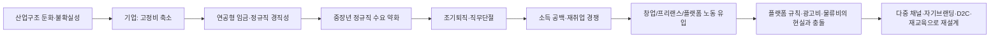
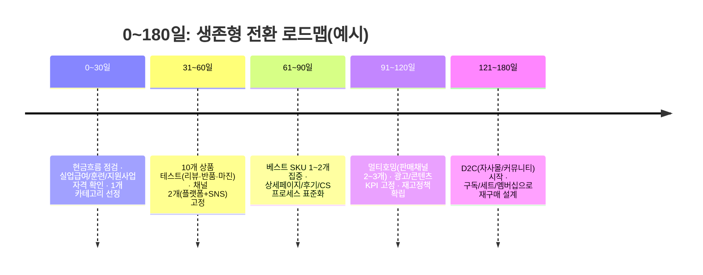

# 40대 조기 퇴직이 ‘현상’이 된 사회, 개인이 살아남는 구조를 다시 짜는 법

## Executive summary

‘40세 퇴직’이라는 말은 과장된 슬로건처럼 들리지만, 핵심은 숫자 40이 아니라 **“정년까지 한 회사에 남아 소득이 이어질 것”이라는 전제가 무너지고 있다**는 점이다. 구조적으로는 퇴직 시점이 앞당겨지고, 제도적으로는 연금·재취업·재교육이 그 속도를 따라가지 못하면서 **소득의 공백(브리지)이 길어진다**. 

이 현상의 중심에 있는 엔진은 세 가지다. 첫째, **연공형 임금과 경직된 내부 노동시장**이 중장년 정규직 수요를 약하게 만든다.  둘째, 기업은 불확실성 시대를 ‘고정비 축소’로 대응하며, 채용도 ‘정기→수시’ ‘장기→프로젝트’로 이동해 왔다.  셋째, 자동화·AI 도입은 직무별로 “보완”과 “대체”를 동시에 밀어 넣으며, 특히 특정 직무군에서 대체 기대가 높게 나타난다. 

개인의 대안은 “무조건 창업” 같은 단일 해법이 아니다. 다만 한 가지는 분명해진다. **한 개의 월급에 인생이 ‘올인’되는 구조를, 다중 소득·다중 채널·다중 역량 구조로 바꾸는 것**이 생존 확률을 높인다. 온라인 쇼핑몰은 그중 현실적인 옵션이지만, ‘감’이 아니라 **수수료·물류·마케팅·고객 데이터**를 계산하는 사업으로 접근해야 한다. 

## 왜 40대가 먼저 밀려나는가

조기 퇴직의 출발점은 “개인이 못해서”가 아니라 “시스템이 그렇게 설계돼 있어서”이다. 한국의 중장년 고용 불안정성이 높게 나타나는 근본 원인으로 **중장년에 대한 정규직 노동수요 부족**이 지목되며, 그 배경으로 과도한 연공형 임금 구조가 거론된다. 쉽게 말해, 회사 입장에서 40대는 ‘가장 일을 잘 아는 세대’이면서 동시에 ‘가장 비싼 고정비’가 되기 쉽다. 

이때 기업의 전략은 잔인할 정도로 단순해진다. 수익이 흔들리는 국면에서 기업은 “매출을 올리는 것”보다 “비용의 형태를 바꾸는 것(고정비→변동비)”을 더 빨리 실행한다. 정규직을 늘리기보다 외주·프로젝트·플랫폼형 계약을 활용하는 이유다. 채용 관행이 정기 중심에서 수시로 이동하고, ‘장기 육성’보다 ‘즉시 투입’이 강화되는 흐름은 이런 비용 구조 변화와 결이 맞는다. 

기술 변화는 이 흐름의 터보 엔진이다. 고용노동부의 디지털 전환 관련 분석에서는 직업 유형에 따라 ‘보완/도움’과 ‘대체’ 응답이 갈리는데, 특히 자동화 영향이 큰 직무군에서 대체 응답 비중이 높게 나타난다.  또 경제협력개발기구는 한국에서 자동화 고위험군 비중을 제시하며, 지역별 편차도 함께 보여 준다.  여기에 AI가 본격적으로 들어오면, 같은 일을 하는 방식이 재편되고 필요한 역량이 바뀐다. 중요한 것은 “AI가 일자리를 없앤다” 한 문장이 아니라, **동일 직무 안에서도 ‘일의 조각’이 재배열되며, 누군가는 더 강해지고 누군가는 밀린다**는 점이다. 

정리하면, 40대 조기 퇴직은 산업구조·고용관행·기업 전략·자동화가 맞물려 만들어내는 결과물이다. 이 구조에서는 “오래 다녔으니 안전하다”가 아니라 “오래 다녔으니 비용 구조상 위험하다”로 평가가 뒤집힐 수 있다. 

## 조기 퇴직이 남기는 계산서

조기 퇴직이 무서운 이유는 ‘수입이 줄어서’만이 아니다. **시간이 길기 때문**이다. 통계청의 고령층 부가조사(2024년 5월) 요약에서는 “가장 오래 근무한 일자리”를 그만둘 당시 평균 연령이 **55~79세 취업경험자 기준 만 52.8세**로 제시된다. ‘정년’이라는 제도적 숫자와 실제 퇴직이 벌어지는 숫자 사이에 간극이 생긴다는 신호다. 

그 간극은 개인에게 ‘소득 브리지’ 문제로 돌아온다. 노령연금은 출생연도별로 지급개시연령이 정해지는 구조이며, 제도적으로는 **가입기간(10년 이상)과 지급개시연령**이 핵심 조건이다.  즉, “일은 50대 초반에 끊기는데, 연금은 더 늦게 시작되는” 구간이 생기기 쉽다. 이 구간에 가계부채, 자녀 교육비, 주거비가 동시에 얹히면 가계는 버티기 게임이 된다.

경력 측면에서도 손실이 크다. 연구는 중장년층의 조기퇴직과 직무단절이 단순한 개인 선택이 아니라 **일자리 수요·임금구조·노동시장 기능**과 연결돼 있음을 보여 준다. 다시 말해 “다른 회사로 옮기면 되지 않나”가 쉬운 해법이 아닌 구조가 존재한다. 

정신건강은 더 조용하게 무너진다. 서울시50플러스재단의 40대 관련 분석 자료는 40대의 경제적·사회적 압박, 그리고 고립과 정신건강 이슈를 함께 다룬다. 특히 40대가 가계의 핵심 부양기 역할을 맡는 경우가 많다는 점에서, 실직·소득하락이 개인의 문제가 아니라 가족 시스템 전체의 위기로 번질 수 있음을 강조한다. 

한편 “그럼 창업하면 되나?”라는 질문도 계산서를 동반한다. 기업생존 데이터를 보면, 신생기업의 5년 생존율은 **36.4%**로 제시되며 업종별 차이가 크다. 특히 판매 경쟁이 치열한 영역은 더 보수적으로 봐야 한다.  또한 온라인 쇼핑 시장 자체는 여전히 크고(예: 2025년 12월 한 달 거래액 24조원대, 모바일 비중 77%대), 성장도 이어지지만, 성장률이 무한히 높던 시절의 ‘쉬운 시장’이라고 보기는 어렵다. 

결론은 단순하다. 조기 퇴직은 ‘재취업/창업’이라는 이지선다 문제가 아니라, **소득·역량·채널·정체성(브랜드)의 퍼즐을 다시 맞추는 문제**이다. 

## 온라인 쇼핑몰이라는 선택지를 ‘사업’으로 성립시키는 법

온라인 쇼핑몰은 많은 사람이 떠올리는 첫 번째 대안이다. 이유는 명확하다. 오프라인 점포처럼 임대료 고정비가 크지 않고, 시장은 이미 모바일 중심으로 굴러가며, 혼자서도 시작할 수 있다.  문제는 “시작”이 아니라 “버팀”이다. 쇼핑몰을 부업으로 열었다가 본업을 잃고 생계형으로 전환되는 순간, 그때부터는 감정이 아니라 현금흐름이 전부가 된다.

### 플랫폼 수수료, ‘몇 퍼센트’가 아니라 ‘어디에서 빠지느냐’가 핵심이다

수수료는 단순히 낮고 높음이 아니라, **어떤 비용이 ‘자동으로’ 붙고, 어떤 비용이 ‘경쟁 때문에 사실상 강제’가 되는지**가 중요하다. 아래는 2024~2025년에 공지·보도된 구조를 기반으로 정리한 비교이며, 실제 적용은 판매자 유형·카테고리·프로모션 참여 여부에 따라 달라질 수 있다. 

| 판매 채널(예시) | 기본 판매(또는 판매수수료) 구조 | 결제 관련 | 물류/배송 관련 | 특징(사업자가 체감하는 نقط) |
|---|---|---|---|---|
| 네이버 생태계 내 스토어 | 2025-06-02 이후 ‘유입수수료’가 아니라 **판매수수료 체계**로 전환(거래액 기준, 요율 구간 존재) | 네이버페이 수수료는 결제·주문관리 등 복합 구조 | 자사 배송, 제휴 물류, 프로그램에 따라 달라짐 | 트래픽이 강하지만 “플랫폼 내 규칙 변화”에 민감함(약관/수수료 체계 변경 시 영향 큼) |
| 쿠팡 마켓플레이스 | 카테고리별 **4~10.9% 판매 수수료**(공식 안내에서 반복 확인) | 별도 결제수단 이중 수수료가 없다고 안내 | 로켓그로스 등은 풀필먼트 비용이 별도(보관/입출고/배송/반품 등) | ‘속도’와 ‘배송 경험’이 구매를 밀어주는 플랫폼. 대신 규격·리뷰·반품을 포함한 운영 난도가 존재 |
| SSG닷컴 오픈마켓 | 오픈 당시 보도에서 카테고리 수수료율 **7~11%**(고정수수료 없앰) | 오픈마켓 판매자 결제수수료는 판매수수료에 포함된다고 공시 | 자체 물류/정책 및 판매 방식에 따라 달라짐 | 서비스 이용료·요율은 판매자센터 공지로 변동 가능(약관에 명시) |

여기서 중요한 결론 하나만 뽑으면 이렇다. **플랫폼은 “장사 장소”가 아니라 “규칙을 가진 운영체제(OS)”**이다. OS 위에서 살려면, 한 곳에만 기대지 말고 멀티 채널로 분산해야 한다. 통계적으로도 기업 생존은 ‘한 번 잘되면 끝’이 아니며, 버티는 구조를 갖춘 쪽이 이긴다. 

### 자체 브랜드(D2C), “수수료를 아끼는 것”보다 “고객을 소유하는 것”이 핵심이다

D2C(자사몰·자체 브랜드)는 오픈마켓의 대안으로 자주 언급되지만, ‘수수료 절감’만 보고 뛰어들면 위험하다. 자료들은 D2C의 강점을 **운영 자유도, 고객 데이터 확보, 충성 고객 관리, 피드백을 빠르게 반영**하는 능력으로 제시한다.  반대로 단점도 명확하다. 자사몰은 결국 “사람을 데려오는 비용”을 스스로 부담해야 한다. 트래픽을 공짜로 주는 플랫폼이 아니기 때문이다. 

그래서 현실적인 답은 ‘올 플랫폼’도 ‘올 D2C’도 아닌 **혼합 전략**이 된다. 오픈마켓에서 검증된 SKU(잘 팔리는 핵심 상품)를 만들고, 그 상품이 낳는 반복 고객을 자사몰·커뮤니티·구독으로 옮겨 심는 식이다. D2C가 강해질수록 플랫폼 의존 리스크는 줄어든다. 

### 소비 트렌드는 “검색해서 사는 쇼핑”에서 “발견해서 사는 쇼핑”으로 이동 중이다

예전에는 쇼핑이 ‘검색’이었고, 지금은 점점 ‘발견’이 된다. 2026년 트렌드 리포트는 목적형 쇼핑과 발견형 쇼핑을 구분하며, 라이브커머스·커뮤니티 같은 참여형 콘텐츠가 “발견”을 강화한다고 설명한다. 

이 흐름이 왜 중요하냐면, 40대 퇴직 이후의 생존 전략이 “기술 하나 더 배우기”만으로 끝나지 않기 때문이다. **채널(유튜브·SNS·라이브·커뮤니티) 자체가 매출 퍼널이 되는 시대**이기 때문이다.  여기에 ‘디토소비’처럼 특정 인물·콘텐츠·채널의 선택을 따라가는 소비 트렌드가 결합하면, 개인의 ‘자기브랜딩’은 선택이 아니라 가격 경쟁을 피하는 방패가 된다. 

구독경제도 같은 맥락이다. 구독 이슈는 소비자 보호 관점에서 정책 보고서가 나올 정도로 생활 속으로 들어왔다.  판매자 관점에서 구독은 ‘매출 예측 가능성’이라는 장점이 있지만, 반대로 해지·환불·고객 경험 관리가 브랜드의 신뢰를 좌우한다.

### 초기 비용과 수익 모델은 “감당 가능한 실험”으로 쪼개야 한다

초기 비용의 본질은 ‘돈’이 아니라 **되돌릴 수 없는 고정비를 얼마나 줄이느냐**이다. 아래 표는 업종·상품에 따라 크게 달라질 수 있음을 전제로 한 **추정치(예시)**이며, 핵심은 “한 번에 크게”가 아니라 “작게 여러 번” 실험하는 방식이다. (수수료·시장 경쟁·생존율 데이터가 말하는 현실은, 과투입이 실패 확률을 키운다는 점이다.) 

| 구분 | 최소(테스트형) | 현실(6개월 버팀형) | 공격(브랜딩/재고 투자형) |
|---|---:|---:|---:|
| 샘플·상품 테스트(리뷰/품질 검증) | 20만~80만 원 | 50만~200만 원 | 200만 원~ |
| 초도 재고(재고형 모델일 때) | 0~200만 원 | 300만~1,000만 원 | 1,000만 원~ |
| 상세페이지/촬영/디자인 | 0~50만 원 | 50만~200만 원 | 200만~500만 원 |
| 포장재·택배 계약/출고 셋업 | 10만~50만 원 | 50만~150만 원 | 150만 원~ |
| 운영 툴(통합관리·CS 등) | 0~5만 원/월 | 5만~20만 원/월 | 20만 원~/월 |
| 마케팅(콘텐츠+광고) | 0~30만 원/월 | 30만~200만 원/월 | 200만 원~/월 |

수익 모델은 크게 세 가지로 갈린다.  
첫째, **플랫폼 최적화형(오픈마켓 내 검색/랭킹/리뷰)**이다. 속도가 빠르지만 가격 비교 경쟁이 심하다.   
둘째, **콘텐츠·디토소비 결합형(유튜브·SNS·라이브로 ‘발견’을 만들고 구매로 연결)**이다. 시간이 걸리지만 가격 방어가 된다.   
셋째, **D2C·구독·커뮤니티형(재구매·락인)**이다. 초기 유입 비용이 크지만 안정화되면 체력이 생긴다.   

아래는 “월 30,000원 제품”을 가정한 단순 시나리오(예시)다. 수수료·광고비·반품률은 채널에 따라 실무적으로 크게 흔들리므로, 반드시 본인 카테고리의 정산표로 재계산해야 한다. (여기서의 목적은 ‘가능/불가능’ 판정이 아니라 **현금흐름 감각**을 얻는 것이다.) 

| 시나리오(예시) | 월 주문수 | 월 매출(원) | 가정한 변수(요약) | 월 순이익(원, 추정) |
|---|---:|---:|---|---:|
| 보수적(유기적 비중 높음) | 200 | 6,000,000 | 플랫폼·결제 6%, 광고 2%, 반품 3%, 고정비 10만 | 1,384,000 |
| 기준(플랫폼+광고 혼합) | 600 | 18,000,000 | 플랫폼·결제 8%, 광고 6%, 반품 4%, 고정비 20만 | 3,136,000 |
| 공격(성장/광고 적극) | 1,200 | 36,000,000 | 플랫폼·결제 8%, 광고 12%, 반품 5%, 고정비 40만 | 3,980,000 |
| D2C(콘텐츠 유입 전환기) | 400 | 12,000,000 | 결제·운영 3%, 광고 12%, 반품 4%, 고정비 25만 | 1,854,000 |
| D2C(콘텐츠+커뮤니티 안정) | 800 | 24,000,000 | 결제·운영 3%, 광고 8%, 반품 4%, 고정비 35만 | 4,818,000 |

### 물류·재고 관리: “내가 물건을 파는가, 시간을 파는가”를 먼저 정한다

물류는 셀러의 생존을 결정하는 숨은 변수다. 직접 포장·출고를 하면 고정비는 낮지만 시간이 빨려 들어간다. 풀필먼트(3PL)를 쓰면 시간은 사지만 비용이 붙는다. 오픈마켓의 풀필먼트(예: 로켓그로스)처럼 플랫폼이 제공하는 물류 옵션은 매출 성장에 도움을 주기도 하지만, 비용 구조를 이해하지 못하면 “팔수록 남는 게 없는” 상황이 생길 수 있다. 

드랍쉬핑(무재고 위탁)은 재고 리스크를 낮추지만, 배송·품질·CS를 통제하기가 어렵다. 결국 중장년 퇴직 이후의 창업에서 중요한 것은 ‘재고를 줄이는 기술’만이 아니라, **고객 경험을 깨뜨리지 않는 운영 능력**이다. 이 운영 능력은 곧 자기브랜딩의 신뢰와 직결된다. 

## 정책과 제도를 ‘보너스’가 아니라 ‘자금줄’로 쓰는 법

정책 지원은 “있으면 좋고”가 아니라, 조기 퇴직 시대에는 **가계 현금흐름을 지탱하는 레버**가 된다. 중요한 것은 정보가 흩어져 있다는 점이고, 그래서 ‘검색 능력’ 자체가 생존 기술이 된다.

첫째, 재취업·전직 지원이다. 고용24와 연계된 중장년 지원 체계는 생애경력설계·전직지원 등을 안내한다.  둘째, 실업급여는 요건을 충족하면 일정 기간 소득을 연결해 주는 장치이며, 법정 수급기간(이직일 다음날부터 12개월)과 지급 수준(평균임금의 60%, 연령·가입기간에 따른 120~270일 범위 등)을 정확히 알아야 한다.  셋째, 훈련은 ‘각성’이 아니라 ‘기회비용’이다. 국민내일배움카드는 훈련비를 5년간 300만~500만 원 범위에서 지원하는 구조로 안내된다. 

창업 지원은 더 적극적으로 설계할 수 있다. 중소벤처기업부 공고에는 재도전성공패키지처럼 실패 경험을 전제로 사업화 자금·멘토링·심리치유 등을 묶어 지원하는 사업이 포함되어 있다(2026년 공고 기준).  K-Startup 포털은 단계별 지원사업 공고를 모아 제공한다.  다만 지원사업은 “선정되면 대박”이 아니라, **사업계획서 작성 과정 자체가 사업 모델을 강제로 정리하게 만드는 훈련**으로 보는 편이 실전적이다.

세금·제도는 ‘절세’ 이전에 ‘분류’를 이해하는 것이 먼저다. 간이과세 기준금액은 2024년 7월부터 8,000만 원 미만에서 1억 400만 원 미만으로 상향되는 정책 변화가 안내된 바 있다.  또한 2026년 시행 간이과세 배제기준(국세청 고시)처럼, 같은 매출이라도 지역·업종 등에 따라 적용이 달라질 수 있는 규칙도 존재한다.  즉, “나는 작게 할 거니까 세금은 대충”이 아니라, **‘내가 속한 규칙’이 무엇인지를 먼저 확정**해야 한다.

마지막으로 소비자 보호·플랫폼 규제 이슈는 장사에도 직접 영향을 준다. 공정거래위원회가 구독경제 관련 소비자 이슈 정책보고서를 발간한 것 자체가, 구독이 ‘유행어’가 아니라 제도·분쟁의 영역으로 들어왔다는 신호다.  판매자는 구독·커뮤니티·라이브를 매출 레버로 쓰되, 환불·해지·고객응대·표시광고를 더 엄격하게 운영해야 “지속 가능한 신뢰”를 확보한다.

## Reference list

- 2024년 5월 경제활동인구조사 고령층 부가조사 결과(그만둘 당시 평균 연령 등)   
- 2025년 12월 온라인쇼핑동향 및 4/4분기 온라인 해외 직접 판매·구매 동향(거래액, 모바일 비중 등)   
- 2024년 기업생멸행정통계(잠정) 결과(신생기업·소멸기업·5년 생존율 등)   
- 40대 고용·부채·위기 관련 분석(서울시50플러스재단)   
- 중장년층 고용 불안정성 및 임금구조 관련 분석(한국개발연구원 FOCUS / NKIS 요약)   
- 디지털 전환에 따른 산업·고용 구조 재편 전망(직무별 보완/대체 응답 등)   
- AI와 한국 노동시장 관련 국제 비교 분석(OECD)   
- 네이버플러스 스토어 수수료 체계(판매수수료 및 판매자 마케팅 수수료) 보도 및 공지 성격 자료   
- 쿠팡 판매 수수료 구조(카테고리별 수수료, 마이샵 운용료 등) 공식 안내   
- SSG닷컴 오픈마켓 수수료율(초기 오픈 시점 보도) 및 판매이용약관·결제수수료 공시   
- ‘디토소비’ 등 소비 트렌드(Trend Korea 2024 요약 및 언론 사례)   
- 구독경제 관련 소비자 이슈 정책보고서(공정거래위원회)   
- 커뮤니티 커머스 관련 국내 연구자료 요약(EIEC)   
- 2026 트렌드 리포트(발견형 쇼핑, 라이브·커뮤니티 커머스 등)   
- D2C/자사몰 전략 개요(미디어 리포트 및 기업 인사이트)   
- 실업급여 신청 및 지급 개요(고용노동부 FAQ)   
- 국민내일배움카드 제도 안내(고용24)   
- 2026년 재도전성공패키지 모집공고(중소벤처기업부/기업마당 공고)   
- 간이과세 기준금액 상향 정책 안내 및 2026 간이과세 배제기준(법령/고시)
