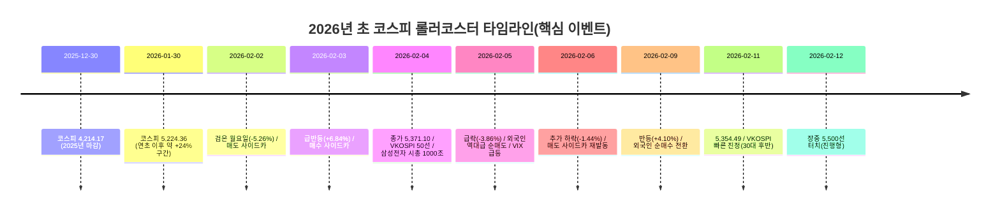

# 연초 이후 +24%가 말해주는 것: 코스피 강세의 진짜 엔진은 어디에 있나

## Executive Summary

2026년 코스피 강세를 ‘운이 좋았다’로 치부하면 중요한 걸 놓친다. 핵심은 두 가지 축이다. 첫째, **이익(실적) 전망이 위로 점프하면서 지수 레벨 자체가 재평가(re-rating)된 흐름**이다. 코스피는 2025년 12월 30일 4,214.17로 한 해를 마친 뒤, 2026년 1월 30일 5,224.36까지 올라서며 **약 +24%**를 찍었다(종가 기준).  둘째, 이 강세는 “시장 전체가 고르게 좋아진” 그림이라기보다 **시가총액 상위(특히 반도체 투톱) 중심의 엔진룸이 과열→급제동→재가속을 반복한 결과**에 가깝다. 

2월 초의 ‘롤러코스터’는 이 구조를 적나라하게 보여준다. 2월 2일(월) 코스피는 -5.26% 급락하며 ‘검은 월요일’을 맞았고, **매도 사이드카**까지 발동했다.  그런데 불과 하루 뒤 2월 3일(화)에는 +6.84% 폭등하며 사상 최고 종가를 경신했고, 이번엔 **매수 사이드카**가 발동했다.  지수는 강한데 공포지수(VKOSPI)는 50을 넘나드는 기묘한 장면도 연출됐다. 이건 “무섭게 흔들리며 올라가는” 장세의 교과서다. 

결론적으로, “코스피가 왜 강한가”의 답은 한 문장으로는 안 끝난다. **실적(특히 반도체) 상향이 만든 ‘기초체력’ 위에, 정책·금리·환율·원자재 쇼크가 만든 ‘충격파’가 파생·프로그램매매를 통해 증폭되며**, 그 과정에서 개인·외국인·기관이 서로 다른 타이밍으로 줄다리기를 한 결과가 지금의 숫자다. 

## 데이터 범위와 해석 기준

분석 기간은 **2025년 12월 30일(2025년 최종 거래일)**부터 **2026년 2월 12일(장중 포함)**까지이다. 12일 수치는 일부가 장중 업데이트(실시간/지연 데이터)일 수 있어, **2월 11일 종가까지는 ‘확정 구간’, 2월 12일은 ‘진행형 구간’**으로 구분해 읽는 편이 안전하다. 

지수(코스피)·변동성(VKOSPI)·미국 변동성지수(VIX)는 일별 시계열을 위해 공개 데이터 페이지를 병행했고, 사이드카 발동 여부는 공시(시장운영 공지)를 우선했다.  수급(개인·외국인·기관 순매수)은 “KRX 단일 시장 기준”과 “거래소 통합 집계(언론 표기)”가 섞여 숫자가 약간씩 달라질 수 있는데, 본문 표에서는 **대규모 방향성(몇 조 단위의 쏠림)**을 복원하는 데 초점을 맞췄다. 

## 연초 이후 +24%는 ‘주가가 뛴’ 이야기가 아니라 ‘이익이 뛴’ 이야기이다

우선 “연초 이후 +24%”라는 문구는 **언제부터 어디까지를 연초로 보느냐**에 따라 의미가 달라진다. 이번 장에서 널리 공유된 +24%는, 코스피가 2025년 12월 30일 4,214.17에서 2026년 1월 30일 5,224.36으로 올라간 구간(종가 기준)을 사실상 가리킨다. 계산하면 +23.97%로, 반올림하면 +24%가 된다.  그 뒤 2월 초 급락·급등을 겪고도 2월 11일 종가는 5,354.49로 연말 대비 약 +27% 수준까지 올라가 있었다.  2월 12일에는 장중 5,500선도 터치할 정도로 속도가 더 붙었다. 

그럼 엔진은 무엇이었나. 가장 큰 축은 **‘이익 전망의 상향’**이다. 2025년 4분기 동안 2026년 코스피 당기순이익 컨센서스가 크게 상향됐고, 그 상향분의 대부분이 소수 대형주(사실상 “두 종목”)에서 발생했다는 리서치 요약이 공개됐다. “이익 전망이 올라가면, 주가가 같은 자리에서도 ‘비싼 주식’이 아니라 ‘벌이가 좋아진 주식’이 된다”는 아주 단순한 원리가 여기서 작동한다. 집으로 치면, 집값이 오를 때 ‘주변 시세가 올라서’ 오르기도 하지만, ‘집주인의 월급이 올라 대출 상환 능력이 좋아져서’ 오르기도 한다. 이 장은 후자 쪽이 컸다. 

이 “두 종목”이 상징하는 건 결국 반도체 사이클이다. 대표 기업인 삼성전자의 경우, 메모리 가격 사이클 진입과 제품 믹스(HBM 등) 개선, 그리고 분기 실적이 컨센서스를 상회할 수 있다는 근거로 목표주가 상향이 이어졌다.  시장은 이걸 “주가가 올랐다”가 아니라 “**레이팅이 바뀌었다**”로 받아들이기 시작한다. 실제로 코스피가 빠르게 레벨업하던 1월 말, 지수 레벨은 높아졌는데도 지수 밸류에이션(예: 12M Fwd P/E)이 오히려 낮아진 데이터가 나온다. 1월 29일 코스피 5,221pt 당시 P/E 10.88, 2월 4일 사상 최고치(5,371.10) 근처에선 P/E 9.37로 제시됐다. 가격만 오르면 보통 P/E도 같이 들썩이는데, 여기서는 **‘가격 상승보다 이익(분모) 증가가 더 컸다’**는 시그널로 읽힌다. 

여기에 정책과 기대가 얹힌다. 국내에선 ‘코리아 디스카운트’ 축소와 기업가치 제고(밸류업) 흐름이 계속 언급됐고, 코스피가 5,000을 넘겼을 때조차 PBR 관점에서 “여전히 낮다”는 프레임이 정치·정책 메시지로도 드러났다. (정책 메시지는 시장에 ‘길을 열어주겠다’는 신호로 작동할 때가 많다. 마치 가게 앞에 ‘영업 허가’가 떨어지면, 손님보다 먼저 임대료가 뛰는 것과 비슷한 구석이 있다.) 

글로벌 금리 환경도 무시할 수 없다. 2026년 1월 연방공개시장위원회는 기준금리 목표범위를 3.5~3.75%로 유지했고, 국내 한국은행도 1월 15일 기준금리를 2.50%로 유지했다. “급하게 더 조이진 않는다”는 환경은 위험자산에 숨을 틔운다. 동시에 “다음 인하가 언제냐”는 기대가 남아 있어, 좋은 실적(특히 반도체처럼 글로벌 수요가 붙는 업종)에 자금이 몰리기 쉬운 바닥을 만든다. 

## 2월 초 급락·급등은 ‘서사’가 아니라 ‘기계적 연쇄반응’에 더 가깝다

2월 초를 이해하려면, 주식시장을 ‘사람들의 감정’만으로 보면 부족하다. **시장은 사람 + 자동매매 + 파생(선물·옵션) + 담보(증거금) + 환율**이 섞인 거대한 연쇄장치다. 버튼 하나가 잘못 눌리면 엘리베이터가 갑자기 아래로 떨어지듯, 가격이 ‘이유가 있어서’가 아니라 ‘멈출 수 없어서’ 움직이는 구간이 생긴다. 2월 2일이 딱 그랬다.

2월 2일(월) 충격의 촉발점으로는 “워시 쇼크”가 널리 거론됐다. 당시 국제 금·은 가격이 하루 만에 급락했고, 그 배경으로는 도널드 트럼프 대통령이 매파 성향으로 분류되는 케빈 워시를 차기 연준 의장 후보로 지명했다는 재료가 시장 불확실성을 키웠다는 분석이 나왔다.  여기에 CME그룹의 귀금속 선물 증거금 요건 강화 공지 등이 겹치며 레버리지 투자자들의 마진콜(추가 증거금 요구)이 연쇄 청산을 만들었다는 해석도 전해졌다.  금·은이 흔들리면 “안전자산이 무너졌다”는 심리 신호가 되고, 동시에 레버리지가 걸린 포지션이 강제 청산되면서 위험자산까지 같이 흔들 수 있다. 실제로 2월 2일 코스피는 -5.26% 급락해 4,949.67로 마감했고, 원·달러 환율은 1,460원대로 급등했다. 

이날 시장 내부에서는 기계가 더 큰 소리를 냈다. 코스피200 선물이 급락하면서 **프로그램 매매 매도호가 일시 효력정지(매도 사이드카)**가 발동됐다(전일 종가 대비 선물가격 -5% 이상 하락이 1분 지속).  외국인·기관이 각각 수조원대 순매도를 기록했고 개인이 대규모로 받아냈지만 지수를 막기엔 역부족이었다.  공포지수로 불리는 VKOSPI도 47.37까지 뛰며 “불안”을 가격에 박아 넣었다. 

그런데 2월 3일(화)은 장면이 뒤집힌다. 코스피는 +6.84% 급등해 5,288.08로 마감, 다시 사상 최고치를 찍었다.  그리고 이번엔 선물이 과열 방향으로 튀면서 **매수 사이드카**가 발동됐다.  수급도 극적으로 반전되어 기관·외국인이 순매수로 돌아섰고 개인은 오히려 순매도 쪽으로 기울었다.  이 반등은 “공포가 사라졌다”기보다 “공포가 너무 빨리 가격에 선반영됐다”에 가깝다. 실제로 금·은 쇼크는 하루 만에 진정 국면으로 들어가며 국내 금 시세가 반등했다는 보도도 이어졌다. 

2월 4일(수)은 상승의 연장이다. 코스피는 5,371.10으로 마감하며 종가 기준 첫 5,300선을 넘겼고, 삼성바이오로직스 등 대형주 흐름 속에 삼성전자는 시가총액 1,000조원 시대를 열었다는 상징적 사건이 발생했다.  다만 흥미로운 건, 지수는 최고치를 경신하는데 VKOSPI는 50을 넘어섰다는 점이다(2월 3일 50.14 → 2월 4일 50.70). “사람들이 행복해서 웃는데 심박수는 과호흡 수준”인 상태라고 보면 된다. 

그리고 2월 5일(목) 다시 급락한다. 코스피는 -3.86% 하락한 5,163.57로 마감했고, 외국인은 코스피에서 **일일 기준 역대 최대 규모(약 5조원) 순매도**를 기록했다는 보도가 나왔다.  VKOSPI는 52.21까지 치솟아 팬데믹 이후 최고 수준이란 평가가 이어졌다.  즉 2월 초는 “상승장이냐 하락장이냐”를 묻기보다, **레버리지·수급·파생이 만드는 ‘진동’이 얼마나 거칠어졌느냐**를 보는 구간이다.

### 시계열 핵심 지표 표

아래 표는 2월 초 급락·급등(검은 월요일 → 급반등 → 재급락) 구간을 날짜별로 정리한 것이다. 코스피 종가·일별 등락률은 일별 공개 데이터(지수 과거 데이터) 기반이며, VKOSPI·VIX도 일별 종가(또는 장중 업데이트 구간 포함) 공개 데이터를 사용했다. 사이드카 발동은 시장운영 공지로 확인했고, 수급은 주요 언론 보도에 표시된 금액을 반영했다. 

| 날짜 | KOSPI 종가 | 일별 등락률 | 개인 순매수(억원) | 외국인 순매수(억원) | 기관 순매수(억원) | 사이드카/프로그램 | 서킷브레이커(지수) | VIX 종가 | VKOSPI 종가 |
|---|---:|---:|---:|---:|---:|---|---|---:|---:|
| 2026-02-02 (월) | 4,949.67 | -5.26% | +45,872 | -25,161 | -22,127 | **매도 사이드카(12:31)** / 프로그램 순매도(약 2.20조) | 없음 | 16.34 | 47.37 |
| 2026-02-03 (화) | 5,288.08 | +6.84% | -33,237 | +9,273 | +23,363 | **매수 사이드카(09:26)** | 없음 | 18.00 | 50.14 |
| 2026-02-04 (수) | 5,371.10 | +1.57% | -10,065 | -9,402 | +17,825 | (사이드카 없음) / 프로그램 순매도(약 0.35조) | 없음 | 18.64 | 50.70 |
| 2026-02-05 (목) | 5,163.57 | -3.86% | +67,639 | -49,941 | -20,705 | (사이드카 없음) | 없음 | **21.77** | **52.21** |
| 2026-02-06 (금) | 5,089.14 | -1.44% | +21,747 | -33,270 | +9,597 | **매도 사이드카(09:06)** | 없음 | 17.76 | 51.48 |
| 2026-02-09 (월) | 5,298.04 | +4.10% | -32,980 | +4,485 | +27,123 | (사이드카 없음) | 없음 | 17.36 | 47.16 |
| 2026-02-10 (화) | 5,301.69 | +0.07% | -8,733 | +1,433 | +5,635 | (사이드카 없음) | 없음 | 17.79 | 42.00 |
| 2026-02-11 (수) | 5,354.49 | +1.00% | -17,146 | +8,602 | +6,898 | (사이드카 없음) | 없음 | 17.65 | 38.88 |
| 2026-02-12 (목, 장중) | 5,494.21 | +2.61% | -26,077 | +13,808 | +12,464 | (사이드카 없음) | 없음 | — | 41.76 |

## 선물·옵션·프로그램매매·사이드카: “사람이 아니라 자동문이 먼저 닫히는 이유”

파생과 프로그램매매를 쉽게 비유하면 이렇다. **현물(주식)은 ‘실제 물건’**이고, **선물은 ‘미리 예약해둔 납품 계약’**에 가깝다. 시장에는 “오늘 사서 내일 주는” 사람만 있는 게 아니라, “한 달 뒤에 이 가격으로 납품/인수하겠다”는 계약을 끼고 도는 사람이 많다. 문제는 이 계약들이 대체로 **증거금(담보)** 위에 쌓인다는 점이다. 담보가 부족해지면 계약이 강제로 정리되며, 가격은 사람이 브레이크를 밟기도 전에 미끄러진다. 2월 2일 금·은 시장에서 마진콜이 연쇄 청산을 만들었다는 설명이 나오는 이유가 여기 있다. 

프로그램매매는 이런 선물·현물의 차이를 이용해 자동으로 사고파는 엔진이다. 평소엔 시장의 유동성을 늘려주지만, 특정 순간엔 군중심리보다 더 빠르게 한쪽으로 몰릴 수 있다. 그래서 한국거래소는 “너무 급하면 자동문을 잠깐 닫는다”는 안전장치를 둔다. 그게 사이드카이다. 2월 2일은 코스피200 선물가격이 전일 종가 대비 -5% 이상 하락이 1분 지속되며 **매도 사이드카**가 발동됐고, 2월 3일엔 반대로 선물이 급등하면서 **매수 사이드카**가 발동됐다.  2월 6일에도 선물 급락으로 매도 사이드카가 다시 발동됐다. 

사이드카의 존재는 투자자 입장에서 “시장이 패닉에 빠졌으니 무조건 나쁘다”라기보다, **‘지금은 자동매매가 시장 한복판을 질주하고 있다’**는 신호로 읽는 편이 실용적이다. 비유를 하나 더 붙이면, 사이드카는 도로 전체를 멈추는 게 아니라 “고속도로 1차선(프로그램 호가)만 잠깐 통제”하는 느낌이다. 장 전체를 멈추는 장치(서킷브레이커)가 따로 있지만, 2월 초 코스피의 등락은 대체로 사이드카 구간에서 설명되는 장면이 많았다. 

여기에 옵션이 얹히면, 시장은 더 ‘감각 과민’해진다. VKOSPI는 코스피200 옵션 가격에서 추정한 향후 변동성 기대치로, 시장이 “앞으로 한 달 동안 얼마나 출렁일 것”을 돈으로 매긴 값이다. 2월 2일 VKOSPI 47.37, 2월 3일 50.14, 2월 4일 50.70으로 치솟았고, 50선 돌파가 팬데믹 초기 이후 처음이라는 보도도 나왔다.  재미있는 대목은, VKOSPI가 이렇게 뛰는데도 코스피는 2월 4일 사상 최고치를 찍었다는 사실이다. 즉 “공포지수 상승 = 지수 하락”이 자동 공식이 아니라, **‘공포(헤지 수요)가 커진 상태에서, 특정 엔진(대형주)이 더 세게 당긴’** 그림이 될 수 있다. 

미국 쪽 ‘공포지수’로 불리는 VIX는 같은 기간 2월 5일 21.77까지 튀었다가 다시 17대까지 내려왔다. 코스피가 2월 5일 급락한 날 VIX도 뛰었다는 점은, 그날의 변동성이 “한국만의 이야기”가 아니라 글로벌 리스크 선호 변화와 맞물려 있었음을 시사한다. 

## 시총 상위 10개 기업 중심으로 본 실적·밸류에이션: ‘코스피’가 아니라 ‘삼하피’에 가까워진 날들

2월 초 변동성이 특히 거칠었던 이유는, 코스피가 “다양한 종목이 고르게 끌어올리는 지수”라기보다 **소수 초대형주의 엔진 추력이 너무 커진 지수**가 되었기 때문이다. 1월 중순 기준으로도 시가총액 1~2위(삼성전자·SK하이닉스)의 비중이 매우 크고, 두 종목이 전체 시총에서 차지하는 비율이 35%대라는 보도가 나왔다.  이런 지수는, 마치 대형 SUV 두 대가 줄다리기 밧줄을 쥐고 있는 게임과 비슷하다. 다른 참가자들이 아무리 버텨도, 두 대가 방향을 바꾸면 게임판 전체가 휜다.

2월 2일 급락에서 이 편중은 그대로 드러났다. 반도체 투톱이 크게 밀리며 지수가 무너졌다는 보도가 있었고, 2월 3일 반등에서도 반도체가 급등해 지수를 끌어올렸다는 평가가 반복됐다.  특히 2월 3일엔 삼성전자(+11.37%)와 SK하이닉스(+9.28%)가 동반 급등하면서 두 종목 시총이 하루 만에 166조원 늘었다는 추정도 나왔다.  반대로 2월 5일 급락은 외국인의 대규모 매도(특히 반도체 중심 차익실현)가 지수 하락을 키웠다는 해석이 많았다. 

이 “상위주 쏠림”은 체감과 지수의 괴리를 만든다. 지수는 뛰는데, 내 계좌는 답답한 이유다. 실제로 최근 시장에서 “상승 종목보다 하락 종목이 더 많았던 날이 절반을 넘는다”는 류의 코멘트가 나온다. 지수가 올라가도 체감이 차가운 장세가 나타나기 쉬운 구조라는 말이다. 

여기서 밸류에이션(특히 “PER이 비싼가?”) 논쟁은 단순하지 않다. 반도체는 경기·사이클에 따라 이익이 크게 흔들리기 때문에, 시장은 때로 PER보다 PBR/ROE 프레임으로 설명하려 한다. 실제로 SK하이닉스는 “PER보다 PBR로 봐야 한다”는 류의 리포트 해석이 나왔고, 높은 ROE 전망을 근거로 높은 적정 PBR을 제시하는 흐름도 관측됐다.  즉 “비싸 보이는데 왜 오르지?”의 답은, 단순히 ‘거품’이 아니라 **(1) 이익이 올라가는 속도, (2) 이익의 지속기간에 대한 시장의 믿음, (3) 지수 내 편중이 만든 수급 충격**이 합성된 결과일 가능성이 크다. 

### 시가총액 상위 10개 기업의 연초 대비 주가·시가총액·PER 변화 표

아래 표는 “코스피 강세를 만든 상위 10개 엔진”을 한 화면에 모으기 위한 목적이다. 다만 **‘연초 대비 PER 변화(기업별)’**는 통일된 공개 원천에서 일괄 추출이 필요해, 현재 환경에선 기업별로 동일 기준(동일 시점·동일 산식)의 PER을 완전하게 채우는 데 제약이 있다. 그래서 본 표는 (a) 시총 상위 10 구성과 (b) 일부 핵심 종목(특히 반도체)의 관측 가능한 변화, (c) 지수 밸류에이션(코스피 P/E)의 이동을 함께 제시한다. “상위주 중심 장세”를 이해하는 데 필요한 실무적 타협이다. 

| 기업(시총 상위권) | 최근 시총(기사/집계 시점) | 연초 대비 주가 변화(확인 가능한 구간) | 밸류에이션 관찰 포인트 |
|---|---:|---:|---|
| **삼성전자** | (2/4 종가 기준) 약 1,000조 돌파 사례 확인 | 2025-12-30 119,900원 → 2026-02-11 167,800원 **약 +40%** | 반도체 이익 상향 → 코스피 P/E 하락에도 주가 상승(분모↑) |
| **SK하이닉스** | (1/16 전후) 시총 약 550조 언급 | 종가 기준 ‘75만원 돌파’ 언급(1/16 전후) → 2/12 장중 88.8만원대 표기 | PER보다 PBR/ROE로 설명하려는 프레임 확대 |
| **LG에너지솔루션** | 시총 약 91조(1/16 전후) | — | 2차전지 내에서도 종목별 차별화·변동성 확대 구간 |
| **삼성바이오로직스** | 시총 약 90조(1/16 전후) | — | 외국인 수급에서 ‘바이오 매수’ 언급되는 흐름 존재 |
| **현대자동차** | 시총 약 85조(1/16 전후) | 1/16 전후 YTD **+42.3%** 언급 | 로봇/피지컬 AI 테마로 재평가 프레임 부각 |
| **한화에어로스페이스** | 시총 약 67조(1/16 전후) | — | 방산·수주 기반 실적 가시성 + 정책/지정학 프리미엄 |
| **HD현대중공업** | 시총 약 66조(1/16 전후) | — | 조선 사이클(수주잔고) 기반 재평가 + 상위주 편입 효과 |
| **두산에너빌리티** | 시총 약 61조(1/16 전후) | — | 전력·에너지 설비/원전 관련 순환매의 대표 주자 |
| **SK스퀘어** | 시총 약 58.9조(1/16 전후) | — | 지수 상위권 재편(인터넷/플랫폼 ↔ 지주/방산/조선 이동) |
| **기아** | 시총 약 58.8조(1/16 전후) | — | 자동차 업황 + 주주환원 기대가 밸류에이션에 영향 |

(참고) 코스피 지수 밸류에이션(P/E)은 1월 29일(코스피 5,221pt) 10.88에서, 2월 4일(코스피 5,371pt) 9.37로 제시되는 등 **가격 상승 구간에서도 하락(또는 둔화)**했다. 이는 상위주의 이익 전망 상향이 강하게 작동한 정황으로 해석할 수 있다. 

## 지속 가능성: “더 오를 수 있나”보다 “무엇이 꺾이면 꺾이나”가 먼저이다

지속 가능성을 보려면, 희망회로보다 체크리스트가 낫다. 다만 체크리스트도 너무 어려우면 결국 안 보게 된다. 그래서 핵심을 세 갈래로 단순화한다. **(1) 실적이 계속 갱신되는가, (2) 환율·금리·정책 변수에서 ‘급제동’이 나오지 않는가, (3) 수급이 특정 한쪽(개인/외국인/기관)만으로 버티는 구간이 길어지지 않는가**이다. 

첫째, 실적의 축이다. 반도체에 대한 시장의 베팅은 “이번 사이클은 구조적으로 다르다”는 주장과 “고점 논쟁”이 공존한다. 실제로 2월 초 외국인의 대규모 매도는 반도체 투톱에 집중됐다는 보도가 있었고, 이는 “상승 피로감 + 글로벌 AI 심리”가 섞였을 가능성을 시사한다.  반대로, 반도체 강세가 재점화될 때는 미국 반도체 지수 흐름이나 개별 기업 코멘트(예: HBM 관련) 같은 촉매가 빠르게 국내 대형주로 전이되는 모습도 확인된다.  즉 지속 가능성의 1번 문턱은 “반도체 이익 상향이 멈추는 순간”이다.

둘째, 환율·금리·정책의 축이다. 2월 2일 급락 때처럼 환율이 급등하면(원화 약세) 외국인은 이익이 나도 “환차손”이 커질 수 있어 포지션을 줄이기 쉽다. 실제로 2월 2일 원·달러 환율 급등, 2월 11일 환율 하락(원화 강세) 같은 장면은 위험 선호와 맞물려 해석되곤 한다.  정책 쪽은 더 미묘하다. 기대를 먹고 오르는 구간은 정책 신호에 민감하고, 반대로 정책이 기대를 못 따라오면 실망도 빨리 온다. 코스피 5,000을 둘러싼 제도개선 메시지(상법 개정 등)도 “이야기”가 아니라 “밸류에이션 정당화”에 쓰이는 재료라는 점에서 영향력이 있다. 

셋째, 수급의 축이다. 2월 초는 개인이 “받아내고”, 외국인이 “던지고”, 기관이 “가끔 방향을 바꾸는” 장면이 반복됐다. 2월 5일 개인 순매수 6조7천억(역대 최대급)과 외국인 5조 순매도(역대 최대)가 같은 날 찍힌 건, 시장이 얼마나 거칠게 힘겨루기 중인지 보여준다.  이후 2월 9~11일 외국인이 순매수로 돌아서며 지수가 다시 레벨을 회복하는 흐름도 관측됐다.  다만 이런 시장은 “정답을 맞히는 게임”이 아니라 “흔들림을 견디는 게임”이 되기 쉽다. VKOSPI가 50을 넘는 구간은 특히 그렇다. 

마지막으로, 이 장세의 가장 현실적인 리스크는 한 문장으로 정리된다. **코스피가 강할수록, 코스피는 ‘코스피 전체’가 아니라 ‘상위 몇 종목’에 더 가까워진다.** 그래서 “지수가 사상 최고치다”라는 뉴스와 “내 주식은 왜 그대로냐”라는 체감이 동시에 존재한다. 그 괴리가 커질수록, 작은 충격에도 변동성은 더 쉽게 튄다. 

## References

- 2025년 코스피 연말 종가(4,214.17) 및 연간 결산 보도(정부/언론)   
- 코스피 지수 일별 종가·등락률(1/12~2/12 구간 공개 시계열)   
- VKOSPI(코스피200 변동성지수) 급등 및 2월 초 수치(47~52 구간) 보도/시계열   
- VIX(미국 변동성지수) 일별 종가(FRED/공개 시계열) 및 2월 5일 급등(21.77) 구간   
- 사이드카 발동 공지(2/2 매도, 2/3 매수, 2/6 매도) 및 발동 조건(선물 -5% 1분 지속 등)   
- 2/2 ‘검은 월요일’(코스피 -5.26%)과 환율 급등, 워시 쇼크 보도   
- 금·은 급락(마진콜/레버리지 청산)과 워시 쇼크 관련 보도 및 분석   
- 2/5 급락과 외국인 역대 최대 순매도(약 5조) 보도   
- 2/9 반등(코스피 +4.10%)과 외국인 순매수 전환, 수급 수치 보도   
- 2/10~2/11 수급(외국인·기관 동반 매수) 및 환율 하락 보도   
- 2/12 장중 5,500선 터치 보도(사상 최고치 경신)   
- 미국 통화정책(1월 FOMC 금리 유지) 및 2026년 FOMC 일정(연준)   
- 한국 통화정책(1/15 기준금리 2.50% 유지, 한국은행)   
- 코스피 상위 10개 종목 비중/시총 재편 및 반도체 쏠림 관련 보도   
- 이익 상향(컨센서스 변화) 관련 리서치 요약(상위 소수 종목 집중)   
- 코스피 P/E 등 지수 밸류에이션 스냅샷(증권사 장마감 코멘트)
